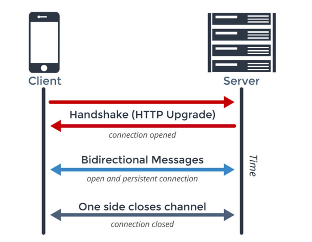

- [1. Nội dung](#1-N%E1%BB%99i-dung)
  - [1.1. Lý thuyết](#11-L%C3%BD-thuy%E1%BA%BFt)
    - [1.1.1. Unit Test/Logging/Performance `[R]`](#111-Unit-TestLoggingPerformance-R)
      - [1.1.1.1. Unit Test](#1111-Unit-Test)
      - [1.1.1.2. Logging](#1112-Logging)
      - [1.1.1.3. Performance](#1113-Performance)
    - [1.1.2. Threading `[R]`](#112-Threading-R)
      - [1.1.2.1. Thread, multithreading & concurrency](#1121-Thread-multithreading--concurrency)
      - [1.1.2.2. Thread-safety trong Java là gì? Làm sao để Thread-safety](#1122-Thread-safety-trong-Java-l%C3%A0-g%C3%AC-L%C3%A0m-sao-%C4%91%E1%BB%83-Thread-safety)
      - [1.1.2.3. Thread pool, executors](#1123-Thread-pool-executors)
    - [1.1.3. Networking `[R]`](#113-Networking-R)
      - [1.1.3.1. Connection pooling](#1131-Connection-pooling)
      - [1.1.3.2. Caching, caching guava, caching redis](#1132-Caching-caching-guava-caching-redis)
      - [1.1.3.3. Khái niệm protocol trong networking, http, websocket, gRPC](#1133-Kh%C3%A1i-ni%E1%BB%87m-protocol-trong-networking-http-websocket-gRPC)
      - [1.1.3.4. SSL/TLS](#1134-SSLTLS)
      - [1.1.3.5. RESTful API](#1135-RESTful-API)
    - [1.1.4. Benchmark `[R]`](#114-Benchmark-R)
      - [1.1.4.1. Benchmark](#1141-Benchmark)
      - [1.1.4.2. Jmeter](#1142-Jmeter)
      - [1.1.4.3. Các tool hỗ trợ benchmark hệ thống cho Java? So sánh?](#1143-C%C3%A1c-tool-h%E1%BB%97-tr%E1%BB%A3-benchmark-h%E1%BB%87-th%E1%BB%91ng-cho-Java-So-s%C3%A1nh)
      - [1.1.4.4. Locust](#1144-Locust)
    - [1.1.5. JVM `[R]`](#115-JVM-R)
      - [1.1.5.1. JVM](#1151-JVM)
      - [1.1.5.2. JRE vs JDK](#1152-JRE-vs-JDK)
    - [1.1.6. Monitoring](#116-Monitoring)
    - [1.1.7. Useful library](#117-Useful-library)
      - [1.1.7.1. Lombok](#1171-Lombok)
      - [1.1.7.2. Mapping in Java](#1172-Mapping-in-Java)
  - [1.2. Bài tập](#12-B%C3%A0i-t%E1%BA%ADp)
    - [1.2.1. Yêu cầu chức năng](#121-Y%C3%AAu-c%E1%BA%A7u-ch%E1%BB%A9c-n%C4%83ng)
    - [1.2.2. Yêu cầu về mặt thiết kế](#122-Y%C3%AAu-c%E1%BA%A7u-v%E1%BB%81-m%E1%BA%B7t-thi%E1%BA%BFt-k%E1%BA%BF)
    - [1.2.3. Yêu cầu Kĩ Thuật](#123-Y%C3%AAu-c%E1%BA%A7u-K%C4%A9-Thu%E1%BA%ADt)
  - [1.3. Tham khảo thêm](#13-Tham-kh%E1%BA%A3o-th%C3%AAm)
- [2. Nguồn tham khảo](#2-Ngu%E1%BB%93n-tham-kh%E1%BA%A3o)


# 1. Nội dung

## 1.1. Lý thuyết

### 1.1.1. Unit Test/Logging/Performance `[R]`
- Unit test
  + http://www.vogella.com/tutorials/JUnit/article.html
  + https://dev.to/ice_lenor/unit-testing-best-practices-27ec
- Logging: 
  + Phân biệt các khái niệm liên quan tới log level
  + Tham khảo: https://logging.apache.org/log4j/2.x/performance.html + keyword phía trên
- Làm rõ khái niệm về throughput và latency, P99. (ý nghĩa của các thông số này)

#### 1.1.1.1. Unit Test 

**What?**

**Unit Testing** (UT) là một mức kiểm thử phần mềm với mục đích để xác nhận từng unit của phần mềm được phát triển đúng như được thiết kế. UT là mức test nhỏ nhất trong bất kỳ phần mềm nào. UT bản thân nó là cái gì đó khá trừu tượng vì tùy dự án, chúng ta có thể quy định “unit” ở mức độ nào. Thông thường, “unit” sẽ được quy định giới hạn trong một hàm (method) hay một class. Trong thực tế, tùy vào kinh nghiệm và kĩ năng, developer sẽ đưa ra quyết định viết các UT như thế nào cho phù hợp, có thể test đầu vào đầu ra của hàm, hay kiểm tra một phần hoặc toàn bộ class.

**Unit test** là test do developer viết, được chạy để kiểm tra các hàm do developer viết ra có sai hay không. UT thường được chạy mỗi khi build để đảm bảo các hàm đều chạy đúng sau khi ta sửa code.

UT là các đoạn code có cấu trúc giống như các đối tượng được xây dựng để kiểm tra từng bộ phận trong hệ thống. Mỗi UT sẽ gửi một số yêu cầu đầu vào và kiểm tra kết quả đầu ra có đúng hay không, bao gồm:

-   Các kết quả trả về mong muốn.
-   Các lỗi ngoại lệ mong muốn.

Các đoạn mã UT hoạt động liên tục hoặc định kỳ để thăm dò và phát hiện các lỗi kỹ thuật trong suốt quá trình phát triển, do đó UT còn được gọi là kỹ thuật kiểm nghiệm tự động.

UT có 3 trạng thái cơ bản:
-   Fail (trạng thái lỗi).
-   Ignore (tạm ngừng thực hiện).
-   Pass (trạng thái làm việc).

UT chỉ thực sự đem lại hiệu quả khi:
-   Được vận hành lặp lại nhiều lần.
-   Tự động hoàn toàn.
-   Độc lập với các UT khác.

**Why?**

Unit testing dùng để chắc chắn rằng code hoạt động chính xác. Unit test là một cách tuyệt vời để thực hiện test hồi quy: đơn giản là chạy chúng mỗi khi thay đổi code và chắc chắn chúng không breaks. Nếu có bug, fix chúng và viết unit test để không bị bug nữa

Chúng ta cần units test trong trường hợp nào?
-   Trường hợp cơ bản:
    -   Đây là trường hợp để nhất để viết, truyền tham số vào và trả về kết quả hợp lý
-   Trường hợp corner (biên)
    -   Cần make sure code hoạt động tốt ở các giá trị biên: 0, -1, INT_MAX, hay empty string
-   Trường hợp lỗi
    -   Cần make sure code chạy xử lý lỗi hợp lý. Nếu một operation về finacial bị failed, thì tiền không bị mất hết
        -   Truyền NULL object, generate exeptions

Ứng dụng:
-   Kiểm tra mọi đơn vị nhỏ nhất là các thuộc tính, sự kiện, thủ tục và hàm.
-   Kiểm tra các trạng thái và ràng buộc của đối tượng ở các mức sâu hơn mà thông thường chúng ta không thể truy cập được.
-   Kiểm tra các quy trình (process) và mở rộng hơn là các khung làm việc (workflow – tập hợp của nhiều quy trình).

Khi nào không cần dùng Unit test:
-   Khi code không quan trọng và business có thể xử lý lỗi trong 1 phần hệ thống
-   Khi nỗ lực để code có thể test và viết test quá lớn, trong khi testing bằng tay không tốn nhiều sức bằng. 
-   Khi đó là prototype, concept, mà bạn cần phát triển nhanh nhất có thể
-   Khi có một dependency mà bạn không thể abstract nó: chuyển nó ra khỏi các module khác nhưng không thể remove it

**How?**


Mỗi UT đều được tiết kế theo trình tự sau:
-   Given: Thiết lập các điều kiện cần thiết: khởi tạo các đối tượng, xác định tài nguyên cần thiết, xây dựng các dữ liệu giả, …
-   When: Triệu gọi các phương thức cần kiểm tra.  
-   Then: Kiểm tra sự hoạt động đúng đắn của các phương thức.
    Dọn dẹp tài nguyên sau khi kết thúc kiểm tra (nếu có).

Chiến lược:
-   Phân tích các tình huống có thể xảy ra đối với mã. Đừng bỏ qua các tình huống tồi tệ nhất có thể xảy ra, thí dụ dữ liệu nhập làm một kết nối cơ sở dữ liệu thất bại, ứng dụng bị treo vì một phép toán chia cho không, các thủ tục đưa ra lỗi ngoại lệ sai có thể phá hỏng ứng dụng một cách bí ẩn, …
-   Mọi UT phải bắt đầu với trạng thái “fail” và chuyển trạng thái “pass” sau một số thay đổi hợp lý đối với mã chính.
-   Mỗi khi viết một đoạn mã quan trọng, hãy viết các UT tương ứng cho đến khi bạn không thể nghĩ thêm tình huống nào nữa.
Nhập một số lượng đủ lớn các giá trị đầu vào để phát hiện điểm yếu của mã theo nguyên tắc:
    -   Nếu nhập giá trị đầu vào hợp lệ thì kết quả trả về cũng phải hợp lệ.
    -   Nếu nhập giá trị đầu vào không hợp lệ thì kết quả trả về phải không hợp lệ
-   Sớm nhận biết các đoạn mã không ổn định và có nguy cơ gây lỗi cao, viết UT tương ứng để khống chế.
-   Ứng với mỗi đối tượng nghiệp vụ (business object) hoặc đối tượng truy cập dữ liệu (data access object), nên tạo ra một lớp kiểm tra riêng vì những lỗi nghiêm trọng có thể phát sinh từ các đối tượng này.
-   Để ngăn chặn các lỗi có thể phát sinh trở lại thực thi tự động tất cả UT mỗi khi có một sự thay đổi quan trọng, hãy làm công việc này mỗi ngày. Các UT lỗi cho chúng ta biết thay đổi nào là nguyên nhân gây lỗi.
-   Để tăng hiệu quả và giảm rủi ro khi viết các UT, cần sử dụng nhiều phương thức kiểm tra khác nhau. Hãy viết càng đơn giản càng tốt.


Test structure:
-   Test naming: tên nên mang tính miêu tả, càng chi tiết càng tốt
-   Small test: mỗi test chỉ nên tập trung 1 scenario
-   Folder structure: test project structure nên lặp lại main project structure
-   Independent test: make sure test không phụ thuộc vào nhau, thực hiện clean vào đầu và cuối mối lần test
-   Change the code - run tests
-   Add the code - write tests

**Implement JUnit in Java**

JUnit là một framework mã nguồn mở, miễn phí, đơn giản dùng để unit test cho ngôn ngữ lập trình Java. Trong Java, chúng ta thường sẽ sử dụng method để làm unit test.

Hiện tại, hầu hết trong các dự án chúng ta vẫn đang sử dụng JUnit 4, nhưng JUnit 5 đã được phát hành và có lẽ nó sẽ trở thành xu hướng trong thời gian sắp tới. 

Tính năng:
-   Mã nguồn mở, viết và chạy kiểm thử
-   Cung cấp annotation định nghĩa phương thức kiểm thử
-   Cung cấp assertion để kiểm tra kết quả mong đợi
-   Cung cấp test runner để thực thi test script
-   Test case JUnit có thể được chạy tự động
-   JUnit cho thấy kết quả test một cách trực quan: pass (không có lỗi) là màu xanh và fail (có lỗi) là màu đỏ.

Một số khái niệm trong Unit test:
-   `Unit test case`: là 1 chuỗi code để đảm bảo rằng đoạn code được kiểm thử làm việc như mong đợi. Mỗi function sẽ có nhiều test case, ứng với mỗi trường hợp function chạy.
-   `Setup`: Đây là hàm được chạy trước khi chạy các test case, thường dùng để chuẩn bị dữ liệu để chạy test.
-   `Teardown`: Đây là hàm được chạy sau khi các test case chạy xong, thường dùng để xóa dữ liệu, giải phóng bộ nhớ.
-   `Assert`: Mỗi test case sẽ có một hoặc nhiều câu lệnh Assert, để kiểm tra tính đúng đắn của hàm.
-   `Mock`: là một đối tượng ảo, mô phỏng các tính chất và hành vi giống hệt như đối tượng thực được truyền vào bên trong khối mã đang vận hành nhằm kiểm tra tính đúng đắn của các hoạt động bên trong. Giả sử chương trình của chúng ta được chia làm 2 module: A và B. Module A đã code xong, B thì chưa. Để test module A, ta dùng mock để làm giả module B, không cần phải đợi tới khi module B code xong mới test được.
-   `Test Suite` : Test suite là một tập các test case và nó cũng có thể bao gồm nhiều test suite khác, test suite chính là tổ hợp các test.

Vòng đời


Kiến trúc:


-   JUnit test framework cung cấp cho chúng ta các gói lớp có sẵn cho phép chúng ta viết các phương thức test một cách dễ dàng.
-   TestRunner sẽ chạy các test và trả về kết quả là các Test Results.
-   Các lớp của chương trình test chúng ta sẽ được kế thừa các lớp trừu tượng TestCase.
-   Khi viết các Test Case chúng ta cần biết và hiểu lớp Assert class.
-   Một số định nghĩa trong mô hình tổng quát:
    -   Test case : test case định nghĩa môi trường mà nó có thể sử dụng để chạy nhiều test khác nhau
    -   TestSuite : testsuite là chạy một tập các test case và nó cũng có thể bao gồm nhiều test suite khác, test suite chính là tổ hợp các test.


Cài đặt JUnit:
-   Ngày nay, JUnit được tích hợp sẵn trong hầu hết các Java IDE (Eclipse, NetBeans và IntelliJ). Nếu không có sẵn, các bạn có thể tạo một project Maven và thêm thư viện JUnit vào file pom.xml như sau:

```xml
<!-- https://mvnrepository.com/artifact/junit/junit -->
<dependency>
    <groupId>junit</groupId>
    <artifactId>junit</artifactId>
    <version>4.12</version>
    <scope>test</scope>
</dependency>
```

Ta xét ví dụ sau: 
-   Phương thức divide() : thực hiện chia phần nguyên của 2 số. Phương thức này nhận 2 đối số: số bị chia (dividend) và số chia (divisor). Nếu số chia là 0 thì chương trình sẽ throw một ngoại lệ, ngược lại chương trình sẽ trả về kết quả sau khi thực hiện chia nguyên.
-   Phương thức add() : sẽ thực hiện tính tổng của 2 số nguyên.


```java
package com.gpcoder.junit.util;
 
public class MathUtil {
 
    private MathUtil() {
        throw new UnsupportedOperationException("Cannot call constructor directly!");
    }
 
    public static int divide(int dividend, int divisor) {
        if (divisor == 0) {
            throw new IllegalArgumentException("Cannot divide by zero (0).");
        }
        return dividend / divisor;
    }
 
    public static int add(int number1, int number2) {
        return number1 - number2;
    }
}
```

-   Cấu trúc lưu trữ:


-   Chúng ta chọn và test các trường hợp có thể dựa vào yêu cầu ở trên

```java
package com.gpcoder.junit.util;
 
import org.junit.Assert;
import org.junit.Test;
 
public class MathUtilTest {
 
    @Test
    public void divide_SixDividedByTwo_ReturnThree() {
        final int expected = 3;
 
        final int actual = MathUtil.divide(6, 2);
 
        Assert.assertEquals(expected, actual);
    }
 
    @Test
    public void divide_OneDividedByTwo_ReturnZero() {
        final int expected = 0;
 
        final int actual = MathUtil.divide(1, 2);
 
        Assert.assertEquals(expected, actual);
    }
 
    @Test(expected = IllegalArgumentException.class)
    public void divide_OneDividedByZero_ThrowsIllegalArgumentException() {
        MathUtil.divide(1, 0);
    }
 
    @Test
    public void add_SixAddedByTwo_ReturnEight() {
        final int expected = 8;
 
        final int actual = MathUtil.add(6, 2);
 
        Assert.assertEquals(expected, actual);
    }
}
```

-   Để chạy kiểm tra các test case trên, chúng ta sẽ chọn chuột phải trên class tương ứng cần test, sau đó chọn Run As –> Unit Test. Tương tự, chúng ta cũng có thể thực thi test cho một phương thức hoặc cả project.


-   Trên kết quả test, chúng ta có thể thấy được tổng thời gian thực hiện tất cả các test case (0.055 seconds), thời gian thực thi mỗi test case, kết quả các test case tương ứng. Như trong ví dụ trên, chúng ta có 3 phương thức pass (có màu xanh) cho phương thức divide(). Điều này có nghĩa là code logic của phương thức devide() đã đúng như mong đợi. Phương thức add_SixAddedByTwo_ReturnEight() có màu đỏ, điều này có nghĩa là logic của phương thức add() đã có gì đó không đúng như mong đợi.

**Độ bao phủ Unit Test (Line coverage)**

Trong Ellipse có hỗ trợ plugin [EclEmma](https://gpcoder.com/1943-huong-dan-su-dung-plugin-eclemma-trong-eclipse/). EclEmma có thể đánh dấu những đoạn code nào mà testcase chưa đáp ứng được, tính tỷ lệ phần trăm độ bao phủ của testcase trên từng file, package, project. Từ đó chúng ta có thể đánh giá được chất lượng của Unit Testcase, cũng như dễ dàng bổ sung testcase cho những đoạn code còn thiếu.


#### 1.1.1.2. Logging

>https://gpcoder.com/5500-gioi-thieu-java-logging/

**What?**

Log là một quá trình ghi lại những thông tin được thông báo, lưu lại trong quá trình hoạt động của một ứng dụng ở một nơi tập trung.

Có nhiều cách để ghi log: có thể lưu vào file, console (sử dụng lệnh sysout), database hoặc đâu đó để có thể xem lại được.'

Trên thực tế không dùng log trên console nhiều do:
-   Chỉ hiển thị kết quả ra console. Vì vậy, mỗi khi console được đóng thì tất cả thông tin log được show trên console cũng mất.
-   Nội dung log được hiển thị trên console rất khó đọc.

**Why?**

Mục đích chính là để có thể xem lại các thông tin hoạt động của ứng dụng trong quá khứ như debug khi có lỗi xảy ra, check health, xem info, error, warning,…

Khi xem lại đoạn log, chúng ta biết được cách tái hiện lại lỗi hay phán đoán lỗi xảy ra như thế nào để khắc phục nhanh hơn và chính xác hơn.


**How?**

Việc đầu tiên trước khi output dòng log ra hãy tưởng tượng sau đó có thể sử dụng được không, hay chỉ là thông tin vô nghĩa.

Ví dụ: khi bạn xử lý một HTTP request từ phía client, request này khi được xử lý thì gây ra lỗi 500 – “Internal server error”. Khi đó thông tin log ở đây ít nhất phải có:
-   Thời gian request.
-   Người request.
-   HTTP request info: header, request, body,…
-   HTTP response info.
-   Error stack trace về error đó như lỗi ở đoạn nào, dòng nào, lỗi gì, input như thế nào,…


`Log Level` :
-   **All**: đây là cấp độ thấp nhất, Logger và Appender được định nghĩa với cấp độ này, mọi thông tin cần log sẽ được log.
-   **Debug**: các thông tin dùng để debug, chúng ta có thể bật/ tắt log này dựa vào mode của application.
-   **Info**: các thông tin mà bạn muốn ghi nhận thêm trong quá trình hoạt động của hệ thống. Ví dụ: log số lượng request, status, duration, … để biết traffic của hệ thống thế nào.
-   **Warning**: log các thông tin cảnh báo của chương trình.
-   **Error**: các lỗi khi chạy chương trình sẽ được log. Cố gắng log toàn bộ thông tin liên quan nhiều nhất có thể để có thể reproduce lại được mà ít tốn thời gian nhất.
-   **Fatal**: log các lỗi nghiêm trọng xảy ra trong chương trình, có thể làm cho chương trình không sử dụng được nữa.
-   **Off**: đây là cấp độ cao nhất, được sử dụng khi chúng ta không muốn log bất kỳ thông tin nào nữa.

`Log rotate`:

Chiến lược cắt nhỏ file lưu trữ trên nhiều file thay vì 1 file:
-   Có thể sẽ lưu file log riêng theo từng ngày, tuần hoặc tháng. Ví dụ: gpcoder-app-20190414.log, gpcoder-app-20190415.log, gpcoder-app-20190416.log,…
-   File log sẽ chia theo loại log: gpcoder-app-20190414.error.log, gpcoder-app-20190414.info.log
-   File log sẽ cắt theo chiến lược khác như dung lượng file. Ví dụ: mỗi file tối đa 100 MB.
-   Hoặc một số chiến lược khác tùy theo yêu cầu của ứng dụng.

`Apache Log4j`:

Apache Log4j hay ngắn gọn là Log4j là một thư viện được cung cấp bởi Apache hỗ trợ ghi log được viết bằng ngôn ngữ Java.

Cách thành phần chính của Log4j:

-   Logger: chịu trách nhiệm thu thập thông tin log.
-   Appender: chịu trách nhiệm ghi log tới các vị trí đã được cấu hình (file, console). Các loại Appender: SyslogAppendersends, SMTPAppender, JDBCAppender, FileAppender, SocketHubAppender, SocketAppender, TelnetAppender, ConsoleAppender, JMSAppender, …
    
-   Layout: chịu trách nhiệm định dạng (format) kết quả log. Các loại Layout: PatternLayout, SimpleLayout, XMLLayout, HTMLLayout.


Các tính năng của Log4j:

-   Thread safe.
-   Tối ưu cho tốc độ.
-   Hỗ trợ nhiều output (file + console).
-   Hỗ trợ nhiều level log: ALL, TRACE, INFO, WARNING, ERROR, FATAL.

Để sử dụng Log4j, chúng ta cần thực hiện theo các bước:

-   Khai báo thư viện cần thiết cho Log4j.
-   Cấu hình Log4j.
-   Đặt câu lệnh log trong ứng dụng.

Cách cài đặt Log4j xem ở [link](https://gpcoder.com/5500-gioi-thieu-java-logging/#Cai_dat_Log4j)

#### 1.1.1.3. Performance

-   `throughput`: là số lượng hành động hoặc kết quả trên một đơn vị thời gian
-   `latency`: là thời gian để thực hiện hành động hoặc tạo ra kết quả
    Mục tiêu là làm sao cho tối đa hóa throughput với latency chấp nhận được
-   `P99 latency`: hay còn gọi là 99th percentile. Nghĩa là 99% requests phải nhanh hơn một latency đưa ra. Nói cách khác, chỉ có 1% requests được phép chậm hơn latency đưa ra. P99 latency được sử dụng phổ biến trong đánh giá băng thông mạng.

Xét thêm IOPS và ví dụ  hoạt động ship hàng từ điểm A đến B:
-   số lượng chuyến đi thưc hiện trong một khoảng thời gian là IOPS
-   số hàng chuyển được trong một khoảng thời gian chính là throughput
-   latency là độ trễ trung bình trong tất cả các chuyến đi trong một khoảng thời gian đã thực hiện
-   Khoảng thời gian này giả sử là một ngày đi.
-   Ba tham số này, đặc biệt là hai tham số IOPS và latency phản ánh chất lượng phục vụ nhưng ko phải lúc nào cũng song hành với nhau kiểu một chỉ số tốt thì các chỉ số còn lại cũng tốt theo:
-   Có thể một ngày có nhiều chuyến hàng nhưng có những chuyến hàng chuyển nhanh, có chuyến hàng chuyển chậm, IOPS cao nhưng latency trung bình cũng lại cao.
-   Có thể một ngày có ít chuyến hàng nhưng mỗi chuyến lại chở full tải thì throughput lại cao dù IOPS thấp vì Throughput = IOPS * IO Average size (IO average size cao thì throughput cao)
-   Có thể latency trung bình thấp nhưng số hàng chuyển cũng không vì thế mà cao được do ít đơn hàng (application ít request vào storage)

Nhưng không phải vì thế mà các tham số này không có ảnh hưởng lên nhau:
-   khi IOPS quá cao, chạm đến giới hạn vật lý của hệ thống thì sẽ gây high latency
-   high latency không xử lý ngay sẽ làm giảm throughput vì data không thực sự được chuyển đến đúng nơi cần đến mà bị nghẽn lại ( busy cũng cao theo )

### 1.1.2. Threading `[R]`
- Khái niệm Thread, multithreading & concurrency?
- Thread-safety trong Java là gì? Làm sao để đạt được Thread-safety? (tham khảo: [Thread-Safety](https://www.baeldung.com/java-thread-safety))
- Tìm hiểu về Thread Pool, Executors. (tham khảo: [Thread Pool](https://www.baeldung.com/thread-pool-java-and-guava))

#### 1.1.2.1. Thread, multithreading & concurrency

**Thread** (luồng) về cơ bản là một tiến trình con (sub-process). Một đơn vị xử lý nhỏ nhất của máy tính có thể thực hiện một công việc riêng biệt. Trong Java, các luồng được quản lý bởi máy ảo Java (JVM).

**Multi-thread** (đa luồng) là một tiến trình thực hiện nhiều luồng đồng thời. Một ứng dụng Java ngoài luồng chính có thể có các luồng khác thực thi đồng thời làm ứng dụng chạy nhanh và hiệu quả hơn.

VD: Trình duyệt web hay các chương trình chơi nhạc là 1 ví dụ điển hình về đa luồng.

+ Khi duyệt 1 trang web, có rất nhiều hình ảnh, CSS, javascript… được tải đồng thời bởi các luồng khác nhau.

+ Khi play nhạc, chúng ta vẫn có thể tương tác được với nút điều khiển như: Play, pause, next, back … vì luồng phát nhạc là luồng riêng biệt với luồng tiếp nhận tương tác của người dùng.

**Ưu điểm của đa luồng**
-   Nó không chặn người sử dụng vì các luồng là độc lập và bạn có thể thực hiện nhiều công việc cùng một lúc.
Mỗi luồng có thể dùng chung và chia sẻ nguồn tài nguyên trong quá trình chạy, nhưng có thể thực hiện một cách độc lập.
-   Luồng là độc lập vì vậy nó không ảnh hưởng đến luồng khác nếu ngoại lệ xảy ra trong một luồng duy nhất.
-   Có thể thực hiện nhiều hoạt động với nhau để tiết kiệm thời gian. Ví dụ một ứng dụng có thể được tách thành : luồng chính chạy giao diện người dùng và các luồng phụ nhiệm gửi kết quả xử lý đến luồng chính.

**Nhược điểm**
-   Càng nhiều luồng thì xử lý càng phức tạp.
-   Xử lý vấn đề về tranh chấp bộ nhớ, đồng bộ dữ liệu khá phức tạp.
-   Cần phát hiện tránh các luồng chết (dead lock), luồng chạy mà không làm gì trong ứng dụng cả.

**Vòng đời của 1 thread trong Java**


Vòng đời của thread trong java được kiểm soát bởi JVM. Java định nghĩa các trạng thái của luồng trong các thuộc tính static của lớp Thread.State:

-   NEW : Đây là trạng thái khi luồng vừa được khởi tạo bằng phương thức khởi tạo của lớp Thread nhưng chưa được start(). Ở trạng thái này, luồng được tạo ra nhưng chưa được cấp phát tài nguyên và cũng chưa chạy. Nếu luồng đang ở trạng thái này mà ta gọi các phương thức ép buộc stop,resume,suspend … sẽ là nguyên nhân sảy ra ngoại lệ IllegalThreadStateException .
-   RUNNABLE : Sau khi gọi phương thức start() thì luồng test đã được cấp phát tài nguyên và các lịch điều phối CPU cho luồng test cũng bắt đầu có hiệu lực. Ở đây, chúng ta dùng trạng thái là Runnable chứ không phải Running, vì luồng không thực sự luôn chạy mà tùy vào hệ thống mà có sự điều phối CPU khác nhau.
-   BLOCKED : Đây là 1 dạng của trạng thái “Not Runnable”. Thread chờ một monitor để unlock một đối tượng mà nó cần.
-   WAITING : Thread chờ không giới hạn cho đến khi một luồng khác đánh thức nó.
-   TIMED_WAITING : Thread chờ trong một thời gian nhất định, hoặc là có một luồng khác đánh thức nó.
-   BLOCKED: Đây là trạng thái khi thread vẫn còn sống, nhưng hiện tại không được chọn để chạy.
-   TERMINATED : Một thread ở trong trạng thái terminated hoặc dead khi phương thức run() của nó bị thoát.

**Concurrency**

Concurrency không chỉ là một khái niệm cho thiết bị có chip nhiều nhân. Trong những thiết bị đơn nhân, chúng ta vẫn có thể xử lý được đa luồng dựa vào cơ chế time-slicing để chuyển ngữ cảnh.


Concurrency (tính đồng thời) là khả năng xử lí nhiều tác vụ cùng 1 lúc. Ví dụ, khi bạn đang lướt web, có thể bạn đang download file trong khi đang nghe nhạc, đồng thời đang scroll trang. Nếu trình duyệt không thể thực hiện chúng cùng 1 lúc, bạn sẽ phải đợi đến khi mọi file download xong, mới có thể nghe nhạc, rồi mới có thể scroll. Điều này nghe rất khó chịu phải không nào?


Từ biểu đồ trên, chúng ta có thể thấy rằng, CPU 1 nhân phân chia thời gian làm việc dựa trên độ ưu tiên của cùng tác vụ. Ví dụ, khi đang scroll trang, việc nghe nhạc sẽ có độ ưu tiên thấp hơn, nên có thể nhạc của bạn sẽ bị dừng do đường truyền kém, nhưng bạn vẫn có thể kéo trang lên xuống.


Có vài điểm khác biệt giữa concurrency và parallelism. Concurrency xử lí nhiều 1 tác vụ 1 lúc, còn parallelism là thực hiện nhiều tác vụ cùng 1 lúc. 


#### 1.1.2.2. Thread-safety trong Java là gì? Làm sao để Thread-safety

Java hỗ trợ multithreading bằng run bytecode một cách đồng thời trong separate worker threads, JVM có khả năng cải thiện hiện năng ứng dụng

Thread-safe nghĩa là các threads có thể truy cập cùng resources mà không gây ra kết quả sai hay không thể dự đoán được

##### 1.1.2.2.1. Staless implementations

Trong phần lớn trường hợp, lỗi là việc chia sẻ  trạng thái giữa các thread không đúng. Cho nên cách đầu tiên đó là dùng staless implementations

```java
public class MathUtils {
     
    public static BigInteger factorial(int number) {
        BigInteger f = new BigInteger("1");
        for (int i = 2; i <= number; i++) {
            f = f.multiply(BigInteger.valueOf(i));
        }
        return f;
    }
}
```

Phương thức factorial() gọi là stateless deterministic function. Nghĩa là cho 1 input, kết quả chắc chắn chỉ cho 1 output. Nó không dựa vào trạng thái bên ngoài và cũng không duy trì trạng thái nào cả. Nên đó được coi là thread-safe vì thế có thể dùng thread gọi cùng 1 lúc mà vẫn ổn, không ảnh hưởng đến kết quả của nhau


##### 1.1.2.2.2. Immutable implementations 

Nếu chúng ta cần chia sẻ trạng thái giữa các thread, ta tạo thread-safe classes bằng cách làm chúng bất biến 

Một class được gọi là immutable khi trạng thái bên trong của nó không thể sửa đổi sau khi khởi tạo

```java
public class MessageService {
     
    private final String message;
 
    public MessageService(String message) {
        this.message = message;
    }
     
    // standard getter
    // no setter     
}
```

MessageService object thì immutable vì trạng thái của nó không thể thay đổi sau khi khởi tạo, nên nó thread-safe

Tuy nhiên nếu nó mutable, nhưng các thread chỉ có quyền read-only, nó cũng thread-safe

##### 1.1.2.2.3. Thread-local fields

Ta tạo thread-safe class mà không share trạng thái giữa các thread bằng việc làm cho chúng thread-local

Ta dễ dàng tạo class mà field của chúng thead-local bằng dùng private fields

```java
public class ThreadA extends Thread {
     
    private final List<Integer> numbers = Arrays.asList(1, 2, 3, 4, 5, 6);
     
    @Override
    public void run() {
        numbers.forEach(System.out::println);
    }
}
```

Khi đó class có các state của nó mà không share với thread khác nên chúng thread-safe

Tương tự, ta tạo thread-local fields  bằng gán ThreadLocal instance vào field. Threa-local fields cũng giống như các field class thông thường ngoại trừ mỗi class truy cập chúng thông qua setter/getter lấy bản copy được khởi tạo độc lập để mỗi thread có trạng thái riêng

```java
public class StateHolder {
     
    private final String state;
 
    // standard constructors / getter
}
```

```java
public class ThreadState {
     
    public static final ThreadLocal<StateHolder> statePerThread = new ThreadLocal<StateHolder>() {
         
        @Override
        protected StateHolder initialValue() {
            return new StateHolder("active");  
        }
    };
 
    public static StateHolder getState() {
        return statePerThread.get();
    }
}
```

##### 1.1.2.2.4. Synchronized collections

Sử dụng set of synchronization wrapper trong collections framework

```java
Collection<Integer> syncCollection = Collections.synchronizedCollection(new ArrayList<>());
Thread thread1 = new Thread(() -> syncCollection.addAll(Arrays.asList(1, 2, 3, 4, 5, 6)));
Thread thread2 = new Thread(() -> syncCollection.addAll(Arrays.asList(7, 8, 9, 10, 11, 12)));
thread1.start();
thread2.start();
```

Synchronized collections sử dụng intrinsic locking  trong cách method. Nghĩa là mỗi thread chỉ có thể được truy cập bởi 1 thread tại 1 thời điểm, các thread còn lại sẽ bị block cho tới khi method được unlock bởi thread đầu tiên. Kém hiệu năng 

##### 1.1.2.2.5. Concurrent collections

Thay vì dùng cái ở trên, Java có cung cấp java.util.concurrent package

```java
Map<String,String> concurrentMap = new ConcurrentHashMap<>();
concurrentMap.put("1", "one");
concurrentMap.put("2", "two");
concurrentMap.put("3", "three");
```

Không giống synchronized collections, concurrent collections đạt thread-safety bằng cách chia nhỏ data thành các segment. Ví dụ trên ConcurrentHashMap, các thread chiếm lock trên các segment khác nhau, vì thế nhiều thread có thể truy cập map đồng  thời

Hiệu năng cao hơn synchronized nhiều

Synchronized và concurrent chỉ làm collections thread safe không phải contents

##### 1.1.2.2.6. Atomic objects

Java cung cấp AtomicInteger, AtomicLong, AtomicBoolean, and AtomicReference.

Atomic class cho phép thực hiện atomic operations đảm bảo thread-safe mà không dùng synchronization. Atomic operation được thực hiện trên 1 single machine level

```java
public class Counter {
     
    private int counter = 0;
     
    public void incrementCounter() {
        counter += 1;
    }
     
    public int getCounter() {
        return counter;
    }
}
```

Ở ví dụ trên, 2 thread có thể truy cập incrementCounter() cùng thời điểm dẫn đến kết quả không xác định, có thể là 2 hoặc số khác


```java
public class AtomicCounter {
     
    private final AtomicInteger counter = new AtomicInteger();
     
    public void incrementCounter() {
        counter.incrementAndGet();
    }
     
    public int getCounter() {
        return counter.get();
    }
}
```
Ta sử dụng AtomicInteger, khi đó counter.incrementAndGet() atomic


##### 1.1.2.2.7. Synchronized methods

Chỉ 1 thread được truy cập 1 synchronized method tại 1 thời điểm, các thread còn lại bị block

```java
public synchronized void incrementCounter() {
    counter += 1;
}
```

Synchronized methods dựa trên intrinsic locks hoặc monitor locks. Khóa nội tại  (intrinsic lock) là một thực thể nội bộ ẩn được liên kết với một thể hiện lớp cụ thể.

Trong ngữ cảnh đa luồng, monitor chỉ là một tham chiếu đến vai trò mà khóa thực hiện trên đối tượng liên quan, vì nó thực thi quyền truy cập độc quyền vào một tập hợp các phương thức hoặc câu lệnh được chỉ định.

When a thread calls a synchronized method, it acquires the intrinsic lock.

We can implement synchronization in instance methods, static methods, and statements (synchronized statements).

##### 1.1.2.2.8. Synchronized statements

```java
public void incrementCounter() {
    // additional unsynced operations
    synchronized(this) {
        counter += 1; 
    }
}
```

Chỉ synchronized một phần của 1 method, hạn chế chi phí của synchronization

##### 1.1.2.2.9. Volatile fields

Các phương thức và khối được đồng bộ hóa rất tiện lợi để giải quyết các vấn đề về khả năng hiển thị biến giữa các luồng. Thậm chí, các giá trị của các trường lớp thông thường có thể được CPU lưu vào bộ nhớ cache. Do đó, các bản cập nhật hệ quả cho một trường cụ thể, ngay cả khi chúng được đồng bộ hóa, có thể không hiển thị với các luồng khác.    

```java
public class Counter {
 
    private volatile int counter;
 
    // standard constructors / getter
     
}
```

Volatile instruct JVM và compiler lưu counter vào main memmory. Theo cách đó,  đảm bảo rằng mỗi khi JVM đọc giá trị của biến đếm, nó sẽ thực sự đọc nó từ bộ nhớ chính, thay vì từ bộ đệm CPU. Tương tự, mỗi khi JVM ghi vào biến đếm, giá trị sẽ được ghi vào bộ nhớ chính.

Việc sử dụng một biến volatile đảm bảo rằng tất cả các biến có thể nhìn thấy đối với một luồng đã cho cũng sẽ được đọc từ bộ nhớ chính.

##### 1.1.2.2.10. Extrinsic locking

Ta có thể cải thiện extrinsic thread-safe bằng dùng extrinsic monitor lock thay vì extrinsic one

Nó cũng share resource trong multithread nhưng mà sử dụng external entity để thực hiện truy cập độc quyền resource

```java
public class ExtrinsicLockCounter {
 
    private int counter = 0;
    private final Object lock = new Object();
     
    public void incrementCounter() {
        synchronized(lock) {
            counter += 1;
        }
    }
     
    // standard getter
     
}
```

With intrinsic locking, where synchronized methods and blocks rely on the this reference, an attacker tạo a deadlock bằng việc chiếm the intrinsic lock and triggering a denial of service (DoS) condition.

An extrinsic lock makes use of a private entity, which is not accessible from the outside

##### 1.1.2.2.11. Reentrant locks

Java cung cấp một tập hợp các triển khai Khóa được cải tiến, có hành vi phức tạp hơn một chút so với các khóa nội tại đã thảo luận ở trên.

Với khóa nội tại, mô hình chiếm khóa khá cứng nhắc: one thread acquires the lock, then executes a method or code block, and finally releases the lock, so other threads can acquire it and access the method.

Không có cơ chế cơ bản nào kiểm tra các luồng được xếp hàng và ưu tiên truy cập vào các chuỗi chờ dài nhất.

Reentrant locks cho phép làm điều đó, ngăn thread queue chịu starvation

```java
public class ReentrantLockCounter {
 
    private int counter;
    private final ReentrantLock reLock = new ReentrantLock(true);
     
    public void incrementCounter() {
        reLock.lock();
        try {
            counter += 1;
        } finally {
            reLock.unlock();
        }
    }
     
    // standard constructors / getter
     
}
```

 When set to true, and multiple threads are trying to acquire a lock, the JVM will give priority to the **longest waiting** thread and grant **access** to the lock.

##### 1.1.2.2.12. Read/write locks

Khóa ReadWriteLock thực sự sử dụng một cặp khóa liên quan, một khóa cho các hoạt động chỉ đọc và một cho các hoạt động ghi.

Nó có thể có nhiều luồng đọc một tài nguyên, miễn là không có luồng nào viết cho nó. Hơn nữa, việc viết luồng vào tài nguyên sẽ ngăn các luồng khác đọc nó.

```java
public class ReentrantReadWriteLockCounter {
     
    private int counter;
    private final ReentrantReadWriteLock rwLock = new ReentrantReadWriteLock();
    private final Lock readLock = rwLock.readLock();
    private final Lock writeLock = rwLock.writeLock();
     
    public void incrementCounter() {
        writeLock.lock();
        try {
            counter += 1;
        } finally {
            writeLock.unlock();
        }
    }
     
    public int getCounter() {
        readLock.lock();
        try {
            return counter;
        } finally {
            readLock.unlock();
        }
    }
 
   // standard constructors
    
}
```

#### 1.1.2.3. Thread pool, executors

>https://gpcoder.com/3548-huong-dan-tao-va-su-dung-threadpool-trong-java/

**What**

Xét về hiệu suất, tạo ra một Thread mới là một hoạt động tốn kém bởi vì nó đòi hỏi hệ điều hành cung cấp tài nguyên để có thể thực thi task (tác vụ). Trên thực tế, ThreadPool được sử dụng cho các ứng dụng quy mô lớn khởi chạy rất nhiều luồng ngắn ngủi để sử dụng hiệu quả các tài nguyên và tăng hiệu suất.

Thay vì tạo các luồng mới khi các task (nhiệm vụ) mới đến, một ThreadPool sẽ giữ một số luồng nhàn rỗi (no task) đã sẵn sàng để thực hiện tác vụ nếu cần. Sau khi một thread hoàn thành việc thực thi một tác vụ, nó sẽ không chết. Thay vào đó nó vẫn không hoạt động trong ThreadPool và chờ đợi được lựa chọn để thực hiện nhiệm vụ mới.

**Why**

Trong Java, ThreadPool được dùng để giới hạn số lượng Thread được chạy bên trong ứng dụng của chúng ta trong cùng một thời điểm. Nếu chúng ta không có sự giới hạn này, mỗi khi có một Thread mới được tạo ra và được cấp phát bộ nhớ bằng từ khóa new thì sẽ có vấn đề về bộ nhớ và hiệu suất, có thể dẫn đến lỗi crash chương trình.

Ví dụ: Khi chúng ta viết chương trình tải các tập tin từ Internet, mỗi tập tin cần 1 Thread để thực hiện quá trình tải, giả sử cần tải 100 tệp hình ảnh thì chúng ta phải cần tới 100 Thread hoạt động cùng một thời điểm trong cùng một chương trình. Điều này sẽ dễ dẫn đến lỗi quá tải của chương trình, làm ảnh hưởng đến hiệu suất và có thể dẫn đến gây lỗi (crash) chương trình.

Trong thực tế, ThreadPool được sử dụng rộng rãi trong các máy chủ web, nơi một ThreadPool được sử dụng để phục vụ các yêu cầu của khách hàng. Thread pool cũng được sử dụng trong các ứng dụng cơ sở dữ liệu nơi mà một ThreadPool được sử dụng để duy trì các kết nối mở với cơ sở dữ liệu.

**How**

Chúng ta có thể giới hạn một số lượng nhất định các Thread đồng thời trong ThreadPool, rất hữu ích để ngăn chặn quá tải. Nếu tất cả các Thread đang bận rộn thực hiện nhiệm vụ, nhiệm vụ mới được đặt trong một hàng đợi (BlockingQueue), chờ đợi một Thread trở nên có sẵn.


**Executor**

Một Executor là một đối tượng chịu trách nhiệm quản lý các luồng và thực hiện các tác vụ Runnable được yêu cầu xử lý. Nó tách riêng các chi tiết của việc tạo Thread, lập kế hoạch (scheduling), … để chúng ta có thể tập trung phát triển logic của tác vụ mà không quan tâm đến các chi tiết quản lý Thread.


Java Concurrency API định nghĩa 3 interfaces cơ bản sau cho các Executor:

-   **Executor**: là interface cha của tất cả Executor. Nó xác định chỉ một phương thực excute(Runnable).
-   **ExecutorService**: là một Executor cho phép theo dõi tiến trình của các tác vụ trả về giá trị (Callable) thông qua đối tượng Future, và quản lý việc kết thúc các luồng. Các phương thức chính của nó bao gồm submit() và shutdown().
-   **ScheduledExecutorService**: là một ExecutorService có thể lên lịch cho các tác vụ để thực thi sau một khoảng thời gian nhất định, hoặc để thực hiện định kỳ. Các phương thức chính của nó là schedule(), scheduleAtFixedRate() and scheduleWithFixedDelay().

Chúng có thể tạo một Executor bằng cách sử dụng một trong các phương thức được cung cấp bởi lớp tiện ích Executors như sau:

-   **newSingleThreadExecutor()**: trong ThreadPool chỉ có 1 Thread và các task (nhiệm vụ) sẽ được xử lý một cách tuần tự.
-   **newCachedThreadPool()**: trong ThreadPool sẽ có nhiều Thread và các nhiệm vụ sẽ được xử lý một cách song song. Các Thread cũ sau khi xử lý xong sẽ được sử dụng lại cho nhiệm vụ mới. Mặc định nếu một Thread không được sử dụng trong vòng 60 giây thì Thread đó sẽ bị tắt.
-   **newFixedThreadPool(int n)**: trong ThreadPool sẽ được cố định các Thread. Nếu một nhiệm vụ mới được đưa vào mà các Thread đều đang “bận rộn” thì nhiệm vụ đó sẽ được gửi vào Blocking Queue và sau đó nếu có một Thread đã thực thi xong nhiệm vụ của nó thì nhiệm vụ đang ở trong Queue đó sẽ được push ra khỏi Queue và được Thread đó xử lý tiếp.
-   **newScheduledThreadPool(int corePoolSize)**: tương tự như newCachedThreadPool() nhưng sẽ có thời gian delay giữa các Thread.
-   **newSingleThreadScheduledExecutor()**: tương tự như newSingleThreadExecutor() nhưng sẽ có khoảng thời gian delay giữa các Thread.

### 1.1.3. Networking `[R]`
- Connection pooling ?
- Caching ? Caching với guava, redis: https://www.baeldung.com/guava-cache, https://redis.io/
- Khái niệm cơ bản về protocol trong networking.
  + http
  + websocket
  + gRPC
- SSL/TLS
- RESTful API là gì?

#### 1.1.3.1. Connection pooling

>https://itphutran.com/connection-pool-trong-java-ket-noi-co-du-lieu-phan-1/


Thông thường, khi xây dựng một ứng dụng web với java,cứ một request đến thì chúng ta cần phải mở và đóng một kết nối.

Với cách làm trên, thì website nhỏ vừa chúng ta hoàn toàn làm như vậy được.Nhưng với một dự án lớn thì việc khi có một request đến thì quá trình mở và đóng kết nối thì việc làm như vậy quá thủ công, điều quan trọng hơn nữa đó là cứ mỗi lần open và close connection mất tầm từ 2-3s. Nếu website của chúng ta có lượng truy cập người dùng cao thì chắc chắn rằng hiệu năng hoạt động của ứng dụng web không tốt.

>Connection pooling (tạm dịch là vùng kết nối) : là kỹ thuật cho phép tạo và duy trì 1 tập các kết nối dùng chung nhằm tăng hiệu suất cho các ứng dụng web bằng cách sử dụng lại các kết nối khi có yêu cầu thay vì việc tạo kết nối mới. 

CPM (Connection pool Manager) là trình quản lý vùng kết nối, một khi ứng dụng được chạy thì Connection pool tạo ra một vùng kết nối, trong vùng kết nối đó có các kết nối do chúng ta tạo ra sẵn.Và như vậy, một khi có một request đến thì CPM kiểm tra xem có kết nối nào đang rỗi không? Nếu có nó sẽ dùng kết nối đó  còn không thì nó sẽ đợi cho đến khi có kết nối nào đó rỗi hoặc kết  nối khác bị timeout.

#### 1.1.3.2. Caching, caching guava, caching redis

##### 1.1.3.2.1. Caching

>https://toidicodedao.com/2018/12/18/caching-la-gi-caching-tang-toc-do-tai/

**Cache** là nơi chứa dữ liệu, nhằm giúp tăng tốc độ truy xuất dữ liệu ở những lần sau.

**Caching** là cách ta hi sinh memory/disk để giảm CPU time, hoặc network time nhằm tăng tốc độ hoặc giảm tải hệ thống.

**Ưu điểm**

-   Vô cùng hiệu quả: 
    -   Giải quyết được vấn đề performance + bottleneck
    -   Giả sử mỗi giây bạn nhận được 100 request, mỗi request sẽ mất 1s để chờ database query xử lý. Database sẽ dễ bị quá tải, người dùng thì chờ mòn râu.
    -   Sử dụng caching để cache kết quả query vào RAM, lúc này thời gian tuy xuất chỉ còn tầm 50-100ms, lại không phải cần truy cập database. Hệ thống được giảm tải, còn người dùng lại nhận được kết quả nhanh hơn rất nhiều nhiều.

    

-   Đơn giản, dễ hiểu, dễ implement
    -   Kể cả khi không dùng thư viện, chỉ cần dùng HashMap dạng Key-Value là bạn đã có thể implement caching một cách đơn giản rồi.
    -   Trong các hệ thống cũng vậy, khi thấy một hàm chạy lâu, tốn nhiều tài nguyên, đôi khi chỉ cần implement caching cho hàm đó là hệ thống đã chạy nhanh ngay, không ảnh hưởng đến các thành phần khác của hệ thống.
-   Support tận răng
    -   Do phổ biến nên hầu như các ngôn ngữ đều có những thư viện hỗ trợ caching cả.
    -   Trong các hệ thống lớn, người ta có những cache server riêng như Redis, Memcache. Các server cache này có performance vô cùng mạnh mẽ, hỗ trợ backup v…v nên rất dễ tích hợp vào hệ thống.

        

**Vấn đề của caching**

-   Stale data - stale cache: nếu không được update thường xuyên   
-   Để giải quyết vấn đề trên, ta phải invalidate cache. Tức là, khi dữ liệu thay đổi, ta phải xóa dữ liệu trong cách, tính toán dữ liệu mới. 
-   Nếu để cache quá lâu thì dữ liệu sẽ bị stale, nếu refresh quá thường xuyên thì cache trở nên … vô dụng (vì tự tính luôn cho rồi). 
-   Ngoài ra, ta còn phải hiểu sẽ business logic hoặc logic của chương trình mới biết được nên cache những gì, cache mất bao lâu nữa!

**Thực tế**

Trong thực tế, caching được sử dụng ở rất nhiều tầng. Thường developer chúng ta sẽ quan tâm caching ở tầm application (vì chúng ta code ở phần này):
-   Trong CPU có caching để tăng tốc độ xử lý
-   SQL Server cũng có caching để lưu query plan
-   Giao thức HTTP hỗ trợ trình duyệt cache các tài nguyên từ server, thông qua header Cache-Control. Nhờ header này mà web thegioididong load nhanh, đỡ phải tải lại resource.
-   Trong lập trình, các kĩ thuật như memoization, dynamic programming cũng sử dụng cache để tăng tốc độ xử lý.
-   Trong các ứng dụng đơn giản, ta thường sử dụng các thư viện cache để lưu dữ liệu vào memory của server.
-   Trong các ứng dụng lớn, có nhiều application server, người ta thường lưu trữ cache trong một server riêng, sử dụng Memcache hoặc Redis
-   Bản thân CDN – Content Delivery Network cũng là một dạng cache, đưa static resource như ảnh, CSS, JS đến server nằm gần người dùng hơn (nhằm tăng tốc độ tải).

##### 1.1.3.2.2. Caching guava

>http://thachleblog.com/cache-voi-guava/


Guava là một thư viện mã nguồn mở Java, được phát triển bởi Google. Guava cung cấp nhiều methods hỗ trợ cho xử lý String, Collections, Caching, Concurrency

Guava hỗ trợ in – memory cache, lưu trữ dữ liệu dưới dạng cặp dữ liệu key – value.  Guava chủ yếu hỗ trợ 2 method cache chính đó là LoadingCache và Cache:
-   LoadingCache: tự động load dữ liệu vào cache nếu trong cache chưa có dữ liệu

-   Cache: chúng ta phải thực hiện các thao tác kiểm tra sự tồn tại của key trước khi put value vào cache, hay get cache

**Implement**

Class StudentGuavaCache, chúng ta có thể override method load hoặc loadAll để add dữ liệu vào cache

```java
import java.util.concurrent.TimeUnit;
import com.google.common.cache.CacheBuilder;
import com.google.common.cache.CacheLoader;
import com.google.common.cache.LoadingCache;
public class StudentGuavaCache {
	private static LoadingCache<Integer, Student> cache;
    static {
		cache = CacheBuilder.newBuilder()
		       .maximumSize(100) //set size
		       .expireAfterWrite(10, TimeUnit.MINUTES) //set time expire
		       .build(
		           new CacheLoader<Integer, Student>() {
						@Override
						public Student load(Integer id) throws Exception {
							return getEmployeeById(id);
						}
		           }
		       );
    }
    public static LoadingCache<Integer, Student> getLoadingCache() {
		return cache;
    }
    // this method demo get data from database or file
	public static Student getEmployeeById(int id) {
		System.out.println("--Executing getStudent--");
		Student student = new Student(1, "Thach Le");
		return student;
	}
}
class Student {
	private int id;
	private String name;
	public Student(int id, String name) {
		this.id = id;
		this.name = name;
	}
	public int getId() {
		return id;
	}
	public void setId(int id) {
		this.id = id;
	}
	public String getName() {
		return name;
	}
	public void setName(String name) {
		this.name = name;
	}
}
```

Class test

```java
import java.util.concurrent.ExecutionException;
import com.google.common.cache.LoadingCache;
public class GuavaTest {
	public static void main(String[] args) {
		GuavaTest guavaTest = new GuavaTest();
		try {
			// Access student first time with id 1, getStudentUsingGuava() will
			// be called.
			System.out.println(guavaTest.getStudentUsingGuava(1).getName());
			System.out.println("------------------------");
 
			// The second time we get student, data will cache
			System.out.println(guavaTest.getStudentUsingGuava(1).getName());
		} catch (ExecutionException e) {
		}
	}
 
	private Student getStudentUsingGuava(int id) throws ExecutionException {
		LoadingCache<Integer, Student> cache = StudentGuavaCache.getLoadingCache();
		System.out.println("Cache Size:" + cache.size());
		return cache.get(id);
	}
 
}
```

Ở ví dụ trên, ta thực hiện khởi tạo object Student sau đó gọi thông qua cache. Ở trên là demo cách cơ bản nhất là load dữ liệu vào cache bằng cách override method load(). Thông thường chúng ta sẽ dùng các phương thức put() để thêm element vào cache và sau đó check và get() để lấy value.

Kết quả


##### 1.1.3.2.3. Caching redis


Redis là hệ thống lưu trữ key-value với rất nhiều tính năng và được sử dụng rộng rãi. Redis nổi bật bởi việc hỗ trợ nhiều cấu trúc dữ liệu cơ bản (hash, list, set, sorted set, string), đồng thời cho phép scripting bằng ngôn ngữ lua. Bên cạnh lưu trữ key-value trên RAM với hiệu năng cao, redis còn hỗ trợ lưu trữ dữ liệu trên đĩa cứng (persistent redis) cho phép phục hồi dữ liệu khi gặp sự cố. Ngoài tính năng replicatation (sao chép giữa master-client), tính năng cluster (sao lưu master-master) cũng đang được phát triển . Để sử dụng một cách hiệu quả những tính năng redis hỗ trợ cũng như vận hành redis với hiệu suất cao nhất thì việc am hiểu hệ thống lưu trữ này là điều không thể thiếu.

**Đặc điểm**

-   Redis hỗ trợ thêm mới, cập nhật và loại bỏ dữ liệu nhanh chóng
-   Redis có những đặc điểm giống như Memcached như:
    -   Lưu trữ dạng key /value.
    -   Tất cả data được lưu trên Memory(RAM)
    -   Key có thể hết hạn(expire) hoặc không
    -   Nhanh(Fast), nhẹ nhàng(light-weight)
-   Redis có thêm nhiều đặc điểm, chức năng khác mang lại lợi ích khi sử dụng và triển khai:
    -   Persistence
    -   Truy vấn theo Key
    -   Hỗ trợ counters dữ liệu kiểu integer
    -   Cấu trúc dữ liệu cấp cao
    -   Nhân rộng master-slave
-   Redis lấy và nạp dữ liệu trên Memory(RAM), nhưng tại một thời điểm thì dữ liệu có thể được lưu trữ trên disk(Data in memory, but saved on disk).
-   Điểm khác biệt dễ nhận thấy của Redis là: Key là một string nhưng value thì không giới hạn ở một string mà có thể là List, Sets, Sorted sets, ….
-   Redis hỗ trợ “Multiple database” với nhiều commands để tự động remove key từ một database tới database khác.
-   Mặc định thì DB 0 sẽ được lựa chọn cho mỗi lần kết nối(connection), nhưng khi sử dụng lệnh SELECT(SELECT command) thì nó có thể select/create một database khác. Thao tác MOVE(MOVE operation) có thể chuyển một item từ một DB tới DB khác một cách tự động.
-   Redis rất nhanh trong các thao tác lấy và nạp dữ liệu do redis hỗ trợ nhiều lệnh mang tính chất chuyên biệt.
-   Redis hỗ trợ mở rộng master-slave nếu chúng ta muốn sự an toàn hoặc mở rộng, co giãn trong việc lưu trữ data

**Redis in Java**

Tạo project maven và add dependency như sau:

```xml
<!-- https://mvnrepository.com/artifact/redis.clients/jedis -->
<dependency>
    <groupId>redis.clients</groupId>
    <artifactId>jedis</artifactId>
    <version>2.9.0</version>
</dependency>
```

File demo

```java
public class MyApp {
	public static void main(String[] args) {
		// Connecting to Redis server on localhost
		Jedis jedis = new Jedis("127.0.0.1");

		System.out.println("Connection to server sucessfully");

		// store data in redis list
		jedis.rpush("KEY_A", "Redis");
		jedis.rpush("KEY_A", "Mongodb");
		jedis.rpush("KEY_A", "Mysql");
		// Get the stored data and print it
		List<String> list = jedis.lrange("KEY_A", 0, -1);

		for (int i = 0; i < list.size(); i++) {
			System.out.println(list.get(i));
		}
	}
}
```

>https://nukeviet.vn/vi/news/Tin-tuc/nukeviet-4-1-se-ho-tro-redis-de-cache-435.html

>https://www.tutorialspoint.com/redis/

#### 1.1.3.3. Khái niệm protocol trong networking, http, websocket, gRPC

##### 1.1.3.3.1. **Protocol**

-   Việc trao đổi thông tin dù là đơn giản nhất cũng phải tuân theo những nguyên tắc nhất định. Đơn giản như hai người nói chuyện với nhau, muốn cho cuộc nói chuyện có kết quả thì ít nhất cả hai người phải ngầm tuân thủ quy ước : Khi một người nói thì người kia phải biết lắng nghe và ngược lại. Việc truyền thông trên mạng cũng vậy. Cần có các quy tắc, quy ước truyền thông về nhiều mặt : khuôn dạng cú pháp của dữ liệu, các thủ tục gửi, nhận dữ liệu, kiểm soát hiệu quả nhất chất lượng truyền thông tin. Tập hợp những quy tắc, quy ước truyền thông đó được gọi là giao thức của mạng (protocol).

-   Một tập hợp tiêu chuẩn để trao đổi thông tin giữa hai hệ thống máy tính hoặc hai thiết bị máy tính với nhau được gọi là giao thức. Các giao thức còn được gọi là các nghi thức hoặc định ước của máy tính.

-   Những giao thức là những cách khác nhau của truyền thông qua mạng Internet.

-   TCP và UDP là những giao thức thông dụng nhất. Giao thức ICMP cũng được dùng nhưng chủ yếu để các thiết bị mạng có thể kiểm tra trạng thái của những thiết bị mạng khác.

-   Những giao thức khác nhau là những ý tưởng cho những kiểu truyền thông khác nhau.

##### 1.1.3.3.2. **HTTP**

**HTTP** (**H**yper**T**ext **T**ransfer **P**rotocol - Giao thức truyền tải siêu văn bản) là một trong các giao thức chuẩn về mạng Internet, được dùng để liên hệ thông tin giữa Máy cung cấp dịch vụ (Web server) và Máy sử dụng dịch vụ (Web client), là giao thức Client/Server dùng cho World Wide Web – WWW

HTTP là một giao thức ứng dụng của bộ giao thức TCP/IP (các giao thức nền tảng cho Internet).

Sơ đồ hoạt động:


HTTP hoạt động dựa trên mô hình Client – Server. Trong mô hình này, các máy tính của người dùng sẽ đóng vai trò làm máy khách (Client). Sau một thao tác nào đó của người dùng, các máy khách sẽ gửi yêu cầu đến máy chủ (Server) và chờ đợi câu trả lời từ những máy chủ này.

HTTP là một **stateless protocol**. Hay nói cách khác, request hiện tại không biết những gì đã hoàn thành trong request trước đó.


Các thành phần chính:
-   HTTP - Requests:
    -   HTTP Request Method: Là phương thức để chỉ ra hành động mong muốn được thực hiện trên tài nguyên đã xác định.
    -   Cấu trúc:
        -   Một Request-line = Phương thức + URI–Request + Phiên bản HTTP . Giao thức HTTP định nghĩa một tập các giao thức GET, POST, HEAD, PUT ... Client có thể sử dụng một trong các phương thức đó để gửi request lên server.
        -   Có thể có hoặc không các trường header
        -   Một dòng trống để đánh dấu sự kết thúc của các trường Header.
        -   Request Header Fields: Các trường header cho phép client truyền thông tin bổ sung về yêu cầu, và về chính client, đến server. Một số trường: Accept-Charset, Accept-Encoding, Accept-Language, Authorization, Expect, From, Host, …
        -   Tùy chọn một thông điệp
    -   Khi request đến server, server thực hiện một trong 3 hành động sau:
        -   Server phân tích request nhận được, maps yêu cầu với tập tin trong tập tài liệu của server, và trả lại tập tin yêu cầu cho client.
        -   Server phân tích request nhận được, maps yêu cầu vào một chương trình trên server, thực thi chương trình và trả lại kết quả của chương trình đó.
        -   Request từ client không thể đáp ứng, server trả lại thông báo lỗi. 

        
    -   1 số HTTP Request method thường dùng: 
    
-   HTTP - Responses
    -   Cấu trúc của một HTTP response:
        -   Một Status-line = Phiên bản HTTP + Mã trạng thái + Trạng thái
        -   Có thể có hoặc không có các trường header
        -   Một dòng trống để đánh dấu sự kết thúc của các trường header
        -   Tùy chọn một thông điệp
    -   Mã trạng thái: Thông báo về kết quả khi nhận được yêu cầu và xử lí bên server cho client.
        -   1xx: Thông tin (100 -> 101)
        -   2xx: Thành công (200 -> 206)
        -   3xx: Sự điều hướng lại (300 -> 307)
        -   4xx: Lỗi phía Client (400 -> 417)
        -   5xx: Lỗi phía Server (500 -> 505)

        

##### 1.1.3.3.3. **Websocket**

Trong mô hình HTTP bạn thấy rằng máy khách sẽ yêu cầu tài nguyên tới máy chủ và máy chủ phản hồi kết quả, như vậy việc trao đổi dữ liệu luôn luôn được máy khách yêu cầu trước và máy chủ không thể gửi bất kỳ dữ liệu tới máy khách trước nếu máy khách chưa yêu cầu.


WebSocket ra đời nhằm giải quyết những hạn chế của bài toán trên bằng cách cung cấp một kênh giao tiếp song song giữa máy khách và máy chủ. Lúc này máy khách và máy chủ có thể trao đổi dữ liệu cho nhau bất cứ lúc nào trong khi kết nối đang mở và cũng có thể đóng kết nối bất cứ lúc nào.



**Cấu trúc Websocket**

Giao thức WebSocket bao gồm hai phần là bắt tay (handshake) và truyền dữ liệu (data transfer). Máy khách khởi tạo handshake bằng cách gửi một yêu cầu tới WebSocket bằng URI mà máy chủ cung cấp và chờ máy chủ xác nhận. Sau khi quá trình handshake thành công thì lúc này máy khách và máy chủ có thể chủ động trao đổi dữ liệu hai chiều cho nhau.

WebSocket hỗ trợ trao đổi truyền tải dữ liệu dạng văn bản (được mã hóa dưới dạng UTF-8) hoặc nhị phân. Chuẩn giao thức của Websocket là ws:// (chuẩn thông thường) hoặc wss:// (tương tự https://). Ví dụ như sau:


>ws://host:port/path?query

>wss://host:port/path?query


```
Như vậy ws thể hiện một kết nối WebSocket không được mã hóa và wss thể hiện cho một kết nối được mã hóa. Cổng mặc định là 80 cho các kết nối không được mã hóa và 443 cho các kết nối được mã hóa.
```

**Khởi tạo trong Java**

Gởi thông điệp đến tất cả các máy khách được kết nối như sau:

```java
@ServerEndpoint("/send")
public class EchoAllEndpoint {
   @OnMessage
   public void onMessage(Session session, String msg) {
      try {
         for (Session sess : session.getOpenSessions()) {
            if (sess.isOpen())
               sess.getBasicRemote().sendText(msg);
         }
      } catch (IOException e) { ... }
   }
}
```
Nhận thông điệp được gởi đến:

```java
@ServerEndpoint("/receive")
public class ReceiveEndpoint {
   @OnMessage
   public void textMessage(Session session, String msg) {
      System.out.println("Text message: " + msg);
   }
   @OnMessage
   public void binaryMessage(Session session, ByteBuffer msg) {
      System.out.println("Binary message: " + msg.toString());
   }
   @OnMessage
   public void pongMessage(Session session, PongMessage msg) {
      System.out.println("Pong message: " + msg.getApplicationData().toString());
   }
}
```

##### 1.1.3.3.4. **gRPC**

gRPC là một framework RPC (viết tắt của Remote Procedure Call) được phát triển bởi Google, nhằm tối ưu hoá và tăng tốc việc giao tiếp giữa các service với nhau trong kiến trúc microservice.

gRPC đã thu hút sự quan tâm của nhiều nhà phát triển microservice trong những năm gần đây vì những điễm nỗi bật sau:
-   Mã nguồn mở.
-   Protocal Buffer giảm kích thước request và response data.
-   RPC đơn giản hoá trong việc tạo ra các giao tiếp giữa các service với nhau.
-   Hỗ trợ HTTP/2 để tăng tốc gửi/nhận HTTP request

-   Khả năng tương thích đa nền tảng.

Tóm lại, ứng dụng gRPC Server phân phối các service methods có thể được gọi trực tiếp bởi các gRPC Client trên các máy và nền tảng khác nhau với cùng tham số và kiểu trả về.

gRPC sử dụng Protocol Buffer để định dạng message request và response giữa máy chủ và máy khách dưới dạng nhị phân. Nó nhỏ gọn hơn JSON và và sau đó chuyển đổi lại ngôn ngữ ban đầu bằng Protocol Buffer compiler.

>https://viblo.asia/p/xay-dung-grpc-service-voi-nodejs-3P0lP9Mm5ox

**Implementation**

>https://www.baeldung.com/grpc-introduction

#### 1.1.3.4. SSL/TLS

**SSL** là chữ viết tắt của **Secure Sockets Layer** (Lớp socket bảo mật). Một loại bảo mật giúp mã hóa liên lạc giữa website và trình duyệt. Công nghệ này đang lỗi thời và được thay thế hoàn toàn bởi TLS.

**TLS** là chữ viết tắt của **Transport Layer Security**, nó cũng giúp bảo mật thông tin truyền giống như SSL. Nhưng vì SSL không còn được phát triển nữa, nên TLS mới là thuật ngữ đúng nên dùng.

**HTTPS** là phần mở rộng bảo mật của HTTP. Website được cài đặt chứng chỉ **SSL/TLS** có thể dùng gaio thức HTTPS để thiết lập kênh kết nối an toàn tới server. Tóm lại, các điều cơ bản về SSL là:

-   Mục tiêu của SSL/TLS là bảo mật các thông tin nhạy cảm trong quá trình truyền trên internet như, thông tin cá nhân, thông tin thanh toán, thông tin đăng nhập.
-   Nó là giải pháp thay thế cho phướng pháp truyền thông tin văn bản dạng plain text, văn bản loại này khi truyền trên internet sẽ không được mã hóa, nên việc áp dụng mã hóa vào sẽ khiến cho các bên thứ 3 không xâm nhập được bào thông tin của bạn, không đánh cắp hay chỉnh sửa được các thông tin đó.
-   Hầu hết mọi người đều quen thuộc với các chứng chỉ SSL/TLS, đang được dùng bởi các website lớn và các webmaster nghiêm túc trong việc bảo vệ các giao dịch người dùng.
-   Bạn có thể biết được website có đang dùng chứng chỉ bảo mật SSL/TLS hay không đơn giản bằng cách nhìn vào icon trong URL ngay trong thanh địa chỉ.

**Cách hoạt động**

Chứng chỉ SSL/TLS hoạt động bằng cách tích hợp key mã hóa vào thông tin định danh công ty. Nó sẽ giúp công ty mã hóa mọi thông tin được truyền mà không bị ảnh hưởng hoặc chỉnh sửa bởi các bên thứ 3.


SSL/TLS hoạt động bằng cách sử dụng public và private key, đồng thời các khóa duy nhất của mỗi phiên giao dịch. Mỗi khi khách truy cập điền vào thanh địa chỉ SSL thông tin web browser hoặc chuyển hướng tới trang web được bảo mật, trình duyệt và web server đã thiết lập kết nối.

Trong phiên kết nối ban đầu, public và private key được dùng để tạo session key, vốn được dùng để mã hóa và giải mã dữ liệu được truyền đưa. Session key sẽ được sử dụng trong một khoảng thời gian nhất định và chỉ có thể dùng cho phiên giao dịch này.

Nếu có khóa màu xanh ngay đầu địa chỉ web thì tức là website đã thiết lập đúng SSL/TLS. Bạn có thể nhấn vào nút màu xanh đó để xem ai là người giữ chứng chỉ này.

**Vì sao cần SSL/TLS?**

SSL/TLS là yếu tố bắt buộc khi bạn cần xử lý các thông tin nhạy cảm như thông tin đăng nhập và mật khẩu, hoặc khi phải xử lý các thông tin thanh toán.

Mục tiêu của SSL/TLS là đảm bảo chỉ có một người nhận mà người gửi chỉ định mới có thể truy cập vào thông tin dữ liệu được truyền đi. Việc này đặc biệt quan trọng khi có rất nhiều thiết bị và server mà thông tin phải đi qua từ lúc gửi đến lúc chính thức tới đúng nơi.


Có 3 lý do chính mà một website hiện đại buộc phải có SSL/TLS:

-   **Khi bạn cần chứng thực**: Bất kỳ server nào cũng có thể giả dạng là server của bạn, đánh cắp thông tin được truyền đưa. SSL/TLS cho phép bạn xác thực danh tính của server để người dùng biết chắc họ đang giao tiếp với đúng người mà họ muốn giao tiếp.
-   **Để tăng độ tin cậy**: Nếu bạn đang chạy một site ecommerce mà bạn cần người dùng đưa các thông tin quan trọng đối với họ, thì ít nhất họ cần biết thông tin họ gửi phải được bảo mật trước thì họ mới tin bạn. Sử dụng SSL/TLS là cách dễ nhất để cho khách truy cập tin tưởng, hơn bất kỳ lời cam kết nào được đưa ra từ phía bạn.
-   **Khi bạn cần tuân thủ chuẩn của ngành của bạn**: Trong một số ngành nhất định, như ngành tài chính, bạn sẽ bắt buộc áp dụng một số chuẩn bảo mật. Bạn cũng có thể tham khảo chỉ dẫn về Payment Card Industry (PCI) mà bạn cần tuân thủ nếu bạn muốn nhận thanh toán qua thẻ tín dụng trên website của bạn. Một trong số các yêu cầu thiết yếu là việc sử dụng chứng chỉ SSL/TLS.


Khi bạn thiết lập chứng chỉ SSL, bạn sẽ cần cấu hình nó truyền dữ liệu qua HTTPS. 2 công nghệ này đi đôi với nhau mà bạn không thể chỉ dùng 1 trong 2.

**Cơ chế kỹ thuật**

Khi người dùng gửi yêu cầu kết nối đến server đối tượng, server gửi SSL server certificate có chứa [puplic key] . Ở trình duyệt của người dùng sử dụng root certificate được cài đặt sẵn trong trình duyệt để kiểm chứng SSL server certificate. Nếu không có vấn đề gì thì mã hóa khóa chung của chính nó bằng [puplic key] được gửi từ server rồi gửi đến server. Phía server thì bằng cách giải mã bằng [secret key] , lấy được khóa chung và thực hiện truyền tin bằng cách sử dụng khóa chung này.


Trong đó, chúng ta chú ý đến phần kiểm chứng certificate. Chứng chỉ không được các tổ chức đáng tin cậy chứng nhận thì không thể xác minh bằng root certificate. Nhiều người sử dụng Internet khi truy cập vào trang web với một trình duyệt cơ bản thì có hiển thị một cảnh báo rằng nó không thể được xác thực, nên rất khó cho người dùng có thể hiển thị màn hình kế tiếp. Do đó, bạn phải sử dụng SSL server certificate được xác thực bởi một bên thứ ba đáng tin cậy.

>https://www.hostinger.vn/huong-dan/https-tls-ssl-la-gi/

#### 1.1.3.5. RESTful API

**API** (application programming interface) là một tập các quy tắc và cơ chế mà theo đó, một ứng dụng hay một thành phần sẽ tương tác với một ứng dụng hay thành phần khác. API có thể trả về dữ liệu mà bạn cần cho ứng dụng của mình ở những kiểu dữ liệu phổ biến như JSON hay XML. 


**REST** là từ viết tắt cho **RE**presentational **S**tate **T**ransfer. Các ứng dụng sử dụng kiểu thiết kế **REST** thì được gọi là **RESTful** (-ful là tiếp vị ngữ giống như beauty và beautiful). Khái niệm này có thể được diễn giải bằng câu từ như sau: dữ liệu sẽ được truyền tải và trình bày cho client side dưới định dạng nào đó (JSON). Có một trong những điểm chính mà bạn cần phải nhớ: REST không phải là một chuẩn hay một giao thức, đây là một cách tiếp cận, một kiểu kiến trúc để viết API.


**RESTful hoạt động như thế nào?**

Khi làm việc với server sẽ gồm 4 hoạt động thiết yếu là:

-   Lấy dữ liệu ở một định dạng nào đó (JSON)
-   Tạo mới dữ liệu
-   Cập nhật dữ liệu
-   Xóa dữ liệu

Bảng tương quan HTTP, CRUD, và SQL


Tất cả các request mà bạn (client side) thực hiện đều cũng sẽ có mã trạng thái HTTP (HTTP status code). Có rất nhiều status code và sẽ được chia ra thành 5 lớp. Chữ số đầu tiên cho biết một status code thuộc vào lớp nào:

-   1xx: hàm ý mang thông tin.
-   2xx: hàm ý thành công
-   3xx: hàm ý điều hướng
-   4xx: hàm ý là có lỗi từ phía client side
-   5xx: hàm ý là có lỗi phía máy chủ (server)

Có tất cả 9 loại request, GET và POST là 2 loại thông dụng được sử dụng nhiều hiện này:

-   GET: được sử dụng để lấy thông tin từ sever theo URI đã cung cấp.
-   HEAD: giống với GET nhưng response trả về không có body, chỉ có header.
-   POST: gửi thông tin tới sever thông qua các biểu mẫu HTTP.
-   PUT: ghi đè tất cả thông tin của đối tượng với những gì được gửi lên.
-   PATCH: ghi đè các thông tin được thay đổi của đối tượng.
-   DELETE: xóa tài nguyên trên server.
-   CONNECT: thiết lập một kết nối tới server theo URI.
-   OPTIONS: mô tả các tùy chọn giao tiếp cho resource.
-   TRACE: thực hiện một bài test loop - back theo đường dẫn đến resource.


**Kiến trúc thiết kế**

Tất cả tài nguyên (resources) trong REST là thực thể (entities). Có thể độc lập như:

-   GET /users — lấy danh sách các người dùng;
-   GET /users/123 — lấy thông tin một người dùng có id = 123;
-   GET /posts — lấy tất cả bài post.

Cũng sẽ có những thực thể độc lập dựa vào những thực thể khác:
-   GET /users/123/projects  – Lấy tất cả projects của user với id = 123

Các ví dụ trên cho thấy rằng GET lấy thông tin thực thể mà client side đã request. Một request thành công sẽ được trả về dữ liệu liên quan tới thực thể và kèm theo status code là 200 (OK). Nếu có lỗi, bạn sẽ nhận lại status code 404 (Not Found), 400 (Bad Request) hoặc 5xx (Server Error).

Cùng chuyển qua phương thức POST (tạo mới một thực thể):

    POST /users.

Khi tạo một thực thể mới, bạn sẽ truyền dữ liệu vào trong request body. Ví dụ:
```json
{
“first_name”: “Vasyl”,
“last_name”: “Redka”
}
```

Sau khi gửi request lên server, bạn sẽ nhận được kết quả trả về có thể là status code 201 (Created), hàm ý tạo mới thành công. Ví dụ, response trả về sẽ là dữ liệu của một thực thể vừa được tạo:

```json 
{
“id”: “1”,
“first_name”: “Vasyl”,
“last_name”: “Redka”
}
```

Request tiếp theo là PUT. Được dùng để cập nhật thực thể. Khi bạn gửi request thì body cũng cần phải bao gồm dữ liệu cần được cập nhật liên qua tới thực thể.

-   PUT /users/123 – cập nhật người dùng với id = 123

Sự thay đổi cần phải được chỉ ra là cập nhật cho thực thể nào, được truyền vào thông qua các tham số. Nếu được cập nhật thành công, sẽ trả về mã 200 (OK) và dữ liệu của thực thể vừa được cập nhật.

Request cuối cùng là DELETE. Nó rất là dễ hiểu và được dùng để xóa một thực thể cụ thể được chỉ định thông qua tham số.

-   DELETE /users/123 – xóa một user với id = 123

Nếu xóa thành công thì sẽ trả về status 200 (OK) cùng với response body bao gồm thông tin về trạng thái của thực thể. Ví dụ, khi bạn không xóa thực thể từ database mà chỉ đánh dấu là đã được xóa, status code sẽ luôn trả về là 200 (OK) và response body với trạng thái. DELETE có thể trả về status 204 (No Content) và không kèm theo response body.

Nếu bạn xóa thực thể trong database luôn thì status code cho request thứ 2 sẽ trả về là 404 (Not Found) bởi vì thực thể đã được xóa và không thể truy cập được nữa.

### 1.1.4. Benchmark `[R]`
  - Benchmark ? 
 - [Jmeter](https://www.baeldung.com/jmeter)
 - [Các tool hỗ trợ benchmark hệ thống dành cho Java? So sánh ưu, nhược điểm?](https://www.baeldung.com/gatling-jmeter-grinder-comparison)
 - [Locust](https://engineering.zalopay.vn/benchmark-voi-locust/)?

#### 1.1.4.1. Benchmark

Benchmark là hành động chạy 1 hay 1 tập chương trình, các thao tác khác để đánh giá performance tương đối của 1 object, thường được chạy bằng 1 lượng các bộ test tiêu chuẩn. Thuật ngữ benchmark cũng thường được sử dụng cho mục đích của các chương trình benchmark được thiết kế công phu.


#### 1.1.4.2. Jmeter

Apache JMeter may be used to test performance both on static and dynamic resources, Web dynamic applications. 

Được dùng để giả lập heavy load trên server, groups server, network để test sức mạnh đánh gía overall performance trên các loại load khác nhau. JMeter is not a browser, it works at protocol level.

Ability to load and performance test many different applications/server/protocol types:

-   Web - HTTP, HTTPS (Java, NodeJS, PHP, ASP.NET, …)
-   SOAP / REST Webservices
-   FTP
-   Database via JDBC
-   LDAP
-   Message-oriented middleware (MOM) via JMS
-   Mail - SMTP(S), POP3(S) and IMAP(S)
-   Native commands or shell scripts
-   TCP
-   Java Object

##### 1.1.4.2.1. Tạo Jmeter script

Jmeter script là một file bao gồm technical description của các test chúng ta. Cập nhật test plan, đổi tên sau đó add Thread Group

Thread Group cho phép chúng ta biết user flow và stimualte cách chúng interact với app, chuột phải vào script name 


Chuyển vô phần configuration của Thread Group, specify number user thực hiện request vào ứng dụng ta parallel


Here, we specified parameters like:

– Name: the name we want to give to the thread group

– The number of Threads (users): the number of parallel users

– Ramp-up time: time needed for going from 0 to the declared number of users

– Loop count: number of repetitions


Next, let’s simulate users’ requests after adding a View Results Tree (Use View Results in Table if the results is a list of records) by following the menu “Add > Listener”.


We can see a more detailed representation of the response on the Sampler result tab.

Let’s end by adding a Duration Assertion in the HTTP Request, so every request that lasts longer than ten milliseconds will be considered as a failed test:


After rerunning the test, we see that there are some (here it’s 3) users that cannot get the lists of students in less than ten milliseconds:


##### 1.1.4.2.2. Run JMeter tests

Có 2 cách: 1 là dùng Maven plugin, còn lại là dùng JMeter non GUI mode

###### 1.1.4.2.2.1. JMeter Maven plugin

Let’s add it to the pom.xml of our project:

```xml
<plugin>
    <groupId>com.lazerycode.jmeter</groupId>
    <artifactId>jmeter-maven-plugin</artifactId>
    <version>2.6.0</version>
    <executions>
        <execution>
            <id>jmeter-tests</id>
            <goals>
                <goal>jmeter</goal>
            </goals>
        </execution>
    </executions>
    <configuration>
        <testFilesDirectory>${project.basedir}/src/main/resources</testFilesDirectory>
        <resultsDirectory>${project.basedir}/src/main/resources</resultsDirectory>
    </configuration>
</plugin>
```

After this, we can run all our tests with mvn verify or just the JMeter ones with mvn jmeter:jmeter; here is the console output of the command:


Note: Here we specified the directory where our tests are located in the project, either the default one(${project.basedir}/src/test/jmeter) will be chosen; likewise is configured the result directory else the default one will be ${project.basedir}/target/jmeter/results.

###### 1.1.4.2.2.2. JMeter Non GUI

The other way to do it’s via the JMeter executable, assuming that it’s available via the command line we can do this:

```sh
jmeter -Jjmeter.save.saveservice.output_format=xml

-n -t src/main/resources/JMeter.jmx -l src/main/resources/JMeter.jtl
```

Note: it’s recommended to not use GUI mode for load testing, only for test creation and test debugging.

#### 1.1.4.3. Các tool hỗ trợ benchmark hệ thống cho Java? So sánh?

>https://cuongquach.com/top-10-cong-cu-ma-nguon-mo-kiem-tra-tai-website-phan-1.html

##### 1.1.4.3.1. JMeter

JMeter là công cụ mã nguồn mở rất phổ biến trong việc kiểm thử khả năng chịu tải cho website. Apache Jmeter là một ứng dụng của Java được thiết kế đặc biệt cho khả năng đo hiệu suất.


**Ưu điểm**
-   Có khả năng kiểm thử với một loạt các công nghệ như Java Objects, Web HTTP/HTTPS, SOAP và Rest Services, FTP, Database với JDBC.

-   Một IDE (Integrated Development Environment) tốt để bạn có thể sử dụng để ghi lại, xây dựng và gỡ lỗi các bài kiểm tra hiệu năng của bạn.

-   Từ phiên bản JMeter 3.1 thì Groovy là ngôn ngữ lập trình mặc định.

-   Một trong những công cụ kiểm tra hiệu suất phổ biến nhất.

-   Nguồn mở, miễn phí

-   Giao diện đơn giản, trực quan dễ sử dụng

-   JMeter lưu các kịch bản kiểm thử của nó dưới dạng các file XML, do đó ta có thể tự tạo các kịch bản kiểm thử của mình bằng một trình soạn thảo bất kỳ và load nó lên
-   Đa luồng, giúp xử lý tạo nhiều request cùng một khoảng thời gian, xử lý các dữ liệu thu được một cách hiệu quả

**Nhược điểm**

-   Gặp khó khăn khi mở rộng quy mô xử lý những bài test phân phối lớn. Đặc biệt nếu bạn thiết lập một cụm máy thì bạn phải cấu hình để chúng có thể trao đổi với nhau.

-   Gặp một loạt các vấn đề dàn xếp khi thực hiện các bài kiểm tra lớn.

**Hình ảnh**


##### 1.1.4.3.2. Locust


Đây là công cụ kiểm tra tải đơn giản, dễ sử dụng và dễ phân phối và tất nhiên nó được sử dụng để kiểm thử tải trang web rồi. Locust cũng có thể giúp bạn tìm ra bao nhiêu người dùng truy cập đồng thời trên web mà hệ thống có thể xử lý được. Bạn cũng có thể xác định hành vi mà bạn muốn cho từng trường hợp kiểm thử. Ngoài ra Locust còn cung cấp giao diện web để bạn theo dõi quá trình benchmark theo thời gian thực.

**Ưu điểm**

-   Khả năng tạo kịch bản cho bài test bằng python.
-   Dễ dàng quy mô số người truy cập mà bạn cần.
-   Giao diện trên nền web rất chất, đẹp.
-   Có khả năng mở rộng.
-   Hiệu quả trong việc test các API.
-   Trên Github hiện tại nó đang được 6293 sao đấy nhé.

**Nhược điểm**

-   Hiện tại chưa thấy nhiều báo cáo về nhược điểm của Locust cả, tuy nhiên bản thân mình thấy thì Locust chỉ sử dụng được khi OS cài python 2.7, 3.3, 3.4, 3.5, và 3.6.
-   Lab thử trên CentOS 6 thì phải cài thêm python 2.7 vì trên CentOS 6 chỉ mặc định cài python 2.6

**Hình ảnh**

Tạo 1 file test mang tên locustfile.py . Do Locust sẽ chạy thực thi dựa trên 1 file cấu hình chuẩn Python


Chạy lệnh: `locust --host=https://localhost:5000`

Trên trình duyệt web bạn truy cập vào theo dạng: `http://<ip_server>:8089 `
. Giao diện Locust khi đăng nhập, nơi bạn có thể quy định bao nhiêu user truy cập và mỗi giây có bao nhiêu user sinh ra


##### 1.1.4.3.3. Gatling


Là công cụ đo khả năng chịu tải được xây dựng trên nền Scala, Akka và Netty. Nó cho phép bạn kiểm tra và đo đạt hiệu suất của ứng dụng end-to-end như website cụ thể.

**Ưu điểm**

-   Là một DSL (Digital Subcriber Line) đơn giản nhưng mạnh mẽ.
-   Dễ dàng mở rộng.
-   Nếu bạn đang tham gia Scala và nhận được vô số lợi ích mà Scala mang lại thì đây chính là công cụ của bạn.
-   Bản thân Gatling có 1 “máy tạo/ghi kịch bản”, thuận lợi cho bạn tạo kịch bản để benchmark tải.
-   Hiện tại Gatling đang được 3297 sao trên Github.

**Hình ảnh**


Chạy tiếp gatling.bat  để kiểm thử kết quả ghi được của record.


Vào xem index.html


#### 1.1.4.4. Locust

Locust là công cụ khá hay để chủ động load test hệ thống trước khi release

Nhiều hệ thống bên mình đang chạy bằng Java và có nhu cầu test với Locust


##### 1.1.4.4.1. Mô hình hoạt động


-   Locust hoạt động theo mô hình client - server
-   Locust server được viết bằng Python, ghi nhận các kết quả test do client báo lên
-   Client có thể viết bằng nhiều ngôn ngữ khác nhau (Python, Go, Java).

##### 1.1.4.4.2. Cách sử dụng

-   Cài đặt Locust theo hướng dẫn
-   Tạo file dummy.py

```python
# coding: utf8

from locust import Locust, TaskSet, task

class MyTaskSet(TaskSet):
    @task(20)
    def hello(self):
        pass

class Dummy(Locust):
    task_set = MyTaskSet
```

Tạo script chạy Locust server:

```bash
#!/usr/bin/env bash

# start locust master
nohup locust -f benchmark/dummy.py --master --master-bind-host=0.0.0.0 \
    --master-bind-port=5557 \
    --web-port=10001 &
```
Chú ý: Locust hỗ trợ giao diện Web (thông qua tham số web-port)

### 1.1.5. JVM `[R]`
-  JVM ? How it work ?
-  JRE vs JDK?

#### 1.1.5.1. JVM

JVM (viết tắt của Java Virtual Machine) là một thiết bị trừu tượng (ảo) có thể giúp máy tính chạy các chương trình Java. Nó cung cấp môi trường runtime mà trong đó Java Bytecode có thể được thực thi.

JVM là có sẵn cho nhiều nền tảng (Windows, Linux…). JVM, JRE và JDK là phụ thuộc nền tảng, bởi vì cấu hình của mỗi OS (hệ điều hành) là khác nhau. Nhưng, Java là độc lập nền tảng. 

Các nhiệm vụ chính của JVM:

-   Tải code
-   Kiểm tra code
-   Thực thi code
-   Cung cấp môi trường runtime

Cấu trúc JVM


Trong đó: 

-   Classloader: Là một hệ thống con của JVM được sử dụng để tải class file.
-   Class (method) Area: Lưu trữ cấu trúc mỗi lớp, chẳng hạn như hằng, trường, dữ liệu phương thức, code của phương thức, …
-   Heap: Nó là khu vực dữ liệu runtime mà trong đó đối tượng được cấp phát.
-   Stack: Stack trong Java lưu giữ các Frame. Nó giữ các biến cục bộ và các kết quả cục bộ, và thực hiện một phần nhiệm vụ trong phần triệu hồi và trả về phương thức. Mỗi Thread có một Stack riêng, được tạo tại cùng thời điểm với Thread. Một Frame mới được tạo mỗi khi một phương thức được triệu hồi và bị hủy khi lời triệu hồi phương thức là kết thúc.
-   Program Counter Register: Nó chứa địa chỉ của chỉ lệnh JVM hiện tại đang được thực thi.
-   Native Method Stack: Bao gồm tất cả các phương thức tự nhiện được sử dụng trong ứng dụng.
-   Execution Engine: Phần này bao gồm:
    -   Một bộ xử lý ảo Virtual Processor
    -   Một trình thông dịch Interpreter. Đọc Bytecode Stream sau đó thực thi các chỉ thị.

-   Just-In-Time (JIT) Compiler: được sử dụng để cải thiện hiệu suất. JIT biên dịch các phần của Bytecode mà có cùng tính năng tại cùng một thời điểm, và vì thế giảm lượng thời gian cần thiết để biên dịch. Ở đây khái niệm Compiler là một bộ biên dịch tập chỉ thị của JVM thành tập chỉ thị của một CPU cụ thể.

Cơ chế làm việc của Java Virtual Machine - JVM được chia thành 3 mô-đun chính:

-   Class-Loader Subsytem : chuyên tìm kiếm và load các file .class vào vùng nhớ của Java.
-   Runtime Data Area : vùng nhớ hệ thống cấp phát cho Java Virtual Machine.
-   Execution Engine: chuyển các lệnh của JVM trong file .class thành các lệnh của máy, hệ điều hành tương ứng và thực thi chúng.

Bộ nhớ trong JVM:

-   Khi thực hiện cấp phát một bộ nhớ hoặc một đối tượng mới có thể được tạo và đặt vào vùng nhớ Heap. Khi ứng dụng của bạn không còn tham chiếu tới đối tượng này nữa thì Java garbage collector cho phép xóa đối tượng này đi để sử dụng lại vùng nhớ đó.

-   Java Heap: JVM giúp lưu tất cả đối tượng đã được tạo ra bởi toán tử “new” trong ứng dụng Java vào trong vùng nhớ Heap ngay tại thời điểm chạy.

-   Java Stack: Các phương thức và tham chiếu tới đối tượng địa phương được lưu trữ trong Stack. Mỗi Thread sẽ được quản lý một stack. Khi phương thức được gọi, nó được đưa vào đỉnh của Stack. Stack lưu trữ trạng thái của phương thức bao gồm: dòng code thực thi, tham chiếu tới đối tượng địa phương. Khi phương thức chạy xong, vùng nhớ (dòng code thực thi, tham chiếu tới đối tượng địa phương) được đẩy ra khỏi stack và tự động giải phóng.

-   Java Perm: Lưu trữ thông tin của Class được nạp vào và một vài tính năng khác như StringPool (vùng nhớ của biến String) thường được tạo bởi phương thức String.interm(). Khi ứng dụng của bạn chạy, Perm space được lấp đầy nhanh chóng.

#### 1.1.5.2. JRE vs JDK

##### 1.1.5.2.1. JRE


JRE (là viết tắt của Java Runtime Environment) được sử dụng để cung cấp môi trường runtime. Nó là trình triển khai của JVM. JRE bao gồm tập hợp các thư viện và các file khác mà JVM sử dụng tại runtime. Trình triển khai của JVM cũng được công bố bởi các công ty khác ngoài Sun Micro Systems. 

##### 1.1.5.2.2. JDK


JDK (là viết tắt của Java Development Kit) bao gồm JRE và các Development Tool. 


### 1.1.6. Monitoring
- [Prometheus](https://engineering.zalopay.vn/monitoring-alert-voi-prometheus/)


Prometheus là một open-source systems monitoring và alert toolkit, được phát triển bởi SoundCloud. Prometheus được viết bằng Go.

Tính năng, đặc điểm chính của Prometheus là:


-   Mô hình dữ liệu đa chiều (multi-dimensional) với dữ liệu chuỗi thời gian (time series) được xác định theo tên và cặp key/value.

-   Cung cấp ngôn ngữ truy vấn linh hoạt để tận dụng các dime.

-   Không phụ thuộc vào lưu trữ phân tán; các nút máy chủ đơn lẻ và độc lập.

-   Các mục tiêu được phát hiện thông qua service discovery hoặc cấu hình tĩnh.

-   Sử dụng các metrics thu thập được từ các service để alert, visualize.

**Mô hình hoạt động**


Một hệ sinh thái Prometheus gồm nhiều thành phần, trong đó có nhiều thành phần là tùy chọn. Về cơ bản bao gồm những thành phần sau:

-   Thành phần chính Prometheus Server, pull các metrics từ service và lưu trữ.
-   Client libary hỗ trợ nhiều ngôn ngữ, dùng để export các metrics.
-   Alertmanager để tiếp nhận và xử lý các alert.
-   Grafana để hiển thị tổng quan các metrics.

Theo đó, với thời gian định kì Prometheus thực hiện pull metrics từ các service thông qua giao thức HTTP.

Tiến hành lưu trữ local hoặc remote tới DB bên thứ 3.

Chạy các rule để record một time series mới dựa trên các time series từ các 
service, hoặc để tạo ra một alert.

Query và Visualize data bằng grafana.

**Data model**


Prometheus lữu trữ dữ liệu dưới dạng time series (timestamp - value), trong đó timestamp là milliseconds và value là giá trí 64-bit float.

Các time series này được phân loại theo metric name và các label
-   Metric name là tên được export từ khác service chỉ định một ý nghĩa đo đạc nào đó.

-   Label được add vào các metric name giúp Prometheus mô hình hóa dữ liệu một cách đa chiều (multi-dimensional)

Ví dụ:

Một metric đo lường số lượng http request tới API Server được đặt `metric name là api_http_requests_total`, add các label `key/value` vào metric name giúp dimensional data, ứng với label `key/value` sẽ cho ra các chuỗi time series khác nhau:

```
api_http_requests_total{method="GET", endpoint="/api/pets", instance="localhost:8080"}
api_http_requests_total{method="GET", endpoint="/api/tracks", instance="10.40.81.11:8080"}
```

Ngôn ngữ truy vấn PromQL sau đó cho phép lọc và tổng hợp dựa trên các dimensions.

Prometheus cung cấp các metric type như sau:


-   Counter: Biểu diễn một metric với giá trị chỉ tăng, reset về 0 khi service restart. Thường được dùng để đo số lượng request vào, ra ..v.v..

-   Gauge: Biểu diễn một metric với giá trị có thể lên xuống. Thường được dùng để đo các giá trị như memory sử dụng, ..v.v..

-   Histogram: Biểu diễn một metric chứa các bucket, các giá trị trong ngưỡng sẽ được tính vào các bucket tương ứng. Thường được dùng để đo giá trị như latency, request size, ..v.v..

-   Summary: Biểu diễn một metric theo %, các giá trị được tính toán và biểu diễn các quantiles. Thường được dùng để đo giá trị như latency, request size, ..v.v..

Lưu ý: Với những service đòi hỏi perfomance thì không nên sử dụng Summary vì nó tính toán trên client thay vào đó nên sử dụng histogram sau đó dùng hàm histogram_quantile để tính ra giá trị giống summary. 

**Alert**

Việc alert với Prometheus thông qua các alert rule

Các alert rule này theo dõi các metric được export từ các service. Khi giá trị các metric này vượt ngưỡng thì Prometheus sẽ trigger một alert và sẽ gửi tới alertmanager.

```
groups:
- name: example
  rules:
  - alert: HighLatency
    expr: job:request_latency_seconds:mean5m{job="myjob"} > 0.5
    for: 10m
    labels:
      severity: page
    annotations:
      summary: High request latency
```

Nếu latency của các request trong vòng 5 phút lớn hơn 0.5 giây thì alert HighLatency sẽ được trigger, alert này nếu như trong vòng 10 phút vẫn còn trigger, tức là latency sau 10 phút vẫn > 0.5 giây thì alert sẽ chuyển sang trạng thái firing và gửi alert tới alertmanager.

Alertmanager sau khi nhận được alert sẽ chờ group_wait (alertmanager config) trước khi gửi alert nhằm tránh việc như gửi cùng 1 alert 100 lần trong vòng một thời gian ngắn.

**Tích hợp vào service**

Các service sử dụng [client libary](https://prometheus.io/docs/instrumenting/clientlibs/) để export các metrics.

Để Prometheus pull các metric Service cần export endpoint:

```java
# Java example 

# Peometheus client
# default endpoint host:1234/metrics
HTTPServer server = new HTTPServer(1234);

# Jetty
Server server = new Server(1234);
ServletContextHandler context = new ServletContextHandler();
context.setContextPath("/");
server.setHandler(context);

context.addServlet(new ServletHolder(new MetricsServlet()), "/metrics");
```

Record metric: java client

```java
class YourClass {
  static final Gauge inprogressRequests = Gauge.build()
     .name("inprogress_requests").help("Inprogress requests.").register();
  
  void processRequest() {
    inprogressRequests.inc();
    // Your code here.
    inprogressRequests.dec();
  }
}
```

### 1.1.7. Useful library
- [Lombok](https://engineering.zalopay.vn/lombok/)
- Map struct: [ref1](https://www.baeldung.com/java-performance-mapping-frameworks) và [ref2](https://www.baeldung.com/mapstruct)

#### 1.1.7.1. Lombok

"Boilerplate" nghĩa là code lặp đi nhiều lần với ít sự thay đổi

Lombok giúp ta giải quyết vấn đề đó

**Getter và Setter**
Thông thường code chúng tương tự nhau và khá nhiều

```java
public class Person {

    private String firstName;
    private String lastName;
    private LocalDate dateOfBirth;
    private Sex sex;

    public enum Sex {
        MALE,
        FEMALE
    }

    public String getFirstName() {
        return this.firstName;
    }

    public String getLastName() {
        return this.lastName;
    }

    public LocalDate getDateOfBirth() {
        return this.dateOfBirth;
    }

    public Sex getSex() {
        return this.sex;
    }

    public void setFirstName(String firstName) {
        this.firstName = firstName;
    }

    public void setLastName(String lastName) {
        this.lastName = lastName;
    }

    public void setDateOfBirth(LocalDate dateOfBirth) {
        this.dateOfBirth = dateOfBirth;
    }

    public void setSex(Sex sex) {
        this.sex = sex;
    }

}
```

Với Lombok chỉ cần như sau:

```java
@Getter
@Setter
public class Person {

    private String firstName;
    private String lastName;
    private LocalDate birthday;
    private Sex sex;

    public enum Sex {
        MALE,
        FEMALE
    }

}
```

**Buider**

```java
Person person = Person.builder()
                .firstName("Bob")
                .lastName("Vu")
                .birthday(LocalDate.of(1991, 1, 1))
                .sex(Person.Sex.FEMALE)
                .build();
```

Lombok chỉ cần như sau:

```java
@Getter
@Setter
@Builder
public class Person {

    private String firstName;
    private String lastName;
    private LocalDate birthday;
    private Sex sex;

    public enum Sex {
        MALE,
        FEMALE
    }

}
```

**Cài đặt**
1. Install lombok plugin for IntelliJ
https://github.com/mplushnikov/lombok-intellij-plugin#plugin-installation

2. Enable Annotation Processing option of IntelliJ https://github.com/mplushnikov/lombok-intellij-plugin#required-intellij-configuration

3. Add lombok as dependency of your module.
Example with maven:
```xml
<dependency>
    <groupId>org.projectlombok</groupId>
    <artifactId>lombok</artifactId>
    <version>${lombok.version}</version>
    <scope>provided</scope>
</dependency>
```

#### 1.1.7.2. Mapping in Java

##### 1.1.7.2.1. Dozer

Dozer là một mapping framework sử dụng đệ quy để sao chép dữ liệu từ đối tượng này sang đối tượng khác.

The framework is able not only to copy properties between the beans, but it can also automatically convert between different types.

```xml
<dependency>
    <groupId>net.sf.dozer</groupId>
    <artifactId>dozer</artifactId>
    <version>5.5.1</version>
</dependency>
```

##### 1.1.7.2.2. Orika

Orika là một khung ánh xạ bean to bean sao chép đệ quy dữ liệu từ đối tượng này sang đối tượng khác.

Nguyên lý chung khá giống với Dozer. Orika sử dụng bytecode generation. Điều này cho phép tạo ra các trình ánh xạ nhanh hơn với chi phí tối thiểu.

```xml
<dependency>
    <groupId>ma.glasnost.orika</groupId>
    <artifactId>orika-core</artifactId>
    <version>1.5.2</version>
</dependency>
```

##### 1.1.7.2.3. MapStruct

MapStruct is a code generator that generates bean mapper classes automatically.

Có khả năng convert các data type khác nhau

```xml
<dependency>3
    <groupId>org.mapstruct</groupId>
    <artifactId>mapstruct-processor</artifactId>
    <version>1.2.0.Final</version>
</dependency>
```

##### 1.1.7.2.4. Model Mapper

Là một framework hướng tới sự đơn giản object mapping, bằng việc xác định how object map với nhau dựa trên quy ước convention. Cung cấp type-safe and refactoring-safe API.

```xml
<dependency>
  <groupId>org.modelmapper</groupId>
  <artifactId>modelmapper</artifactId>
  <version>1.1.0</version>
</dependency>
```

##### 1.1.7.2.5. JMapper

JMapper is the mapping framework that aims to provide easy-to-use, high-performance mapping between Java Beans.


The framework aims to apply DRY principle using Annotations and relational mapping.

The framework allows for different ways of configuration: annotation-based, XML or API-based.

```xml
<dependency>
    <groupId>com.googlecode.jmapper-framework</groupId>
    <artifactId>jmapper-core</artifactId>
    <version>1.6.0.1</version>
</dependency>
```

##### 1.1.7.2.6. Compare

Average time 


Throughput


## 1.2. Bài tập

### 1.2.1. Yêu cầu chức năng  

[Trò chơi Oẳn Tù Tì](https://en.wikipedia.org/wiki/Rock%E2%80%93paper%E2%80%93scissors)  
 - Thiết kế hệ thống cung cấp APIs cho gameplay của trò chơi Oẳn tù tì với máy. Luật chơi như sau:
  + Mỗi 1 game sẽ gồm n lượt chơi (n >= 1)
  + Trong mỗi lượt, server sẽ trả lời là người chơi thắng, thua hay hoà (kèm kết quả KÉO/BÚA/BAO của máy).
  + Nếu kết quả của lượt chơi là thắng hoặc thua, game kết thúc.
  + Nếu kết quả là hoà, phải chơi thêm lượt tiếp theo đến khi có kết quả thắng hoặc thua.
 - User phải thực hiện đăng nhập mới gọi được API và cung cấp API cho user đăng kí tài khoản.
 - Lưu lại lịch sử tất cả các game + lượt chơi của user.
 - Cung cấp API truy vấn lịch sử tất cả game + lượt chơi của user.
 - Cung cấp API liệt kê danh sách 100 user có tỉ lệ thắng cao nhất.

### 1.2.2. Yêu cầu về mặt thiết kế  
 - Sequence diagram cho tất cả các API/function  
 - Tài liệu mô tả architecture của hệ thống  
 - Tài liệu mô tả thiết kế lưu trữ data model của hệ thống  

### 1.2.3. Yêu cầu Kĩ Thuật  
 - Cung cấp API cho cả 2 protocol (tránh code duplication):  
   + HTTP với Json
   + gRPC với Protobuf
 - Sử dụng [JWT](https://jwt.io/) cho phần authentication.
 - Có thể viết 1 web client đơn giản hoặc sử dụng Postman hoặc công cụ bất kì để test API.
 - Viết Unit Test với line coverage 80%.
 - Thực hiện Performance Test cho API sử dụng Locust, JMeter hoặc công cụ tương tự.
 - Ghi log cho tất cả lời gọi tới API. Đối với trường hợp lỗi hệ thống phải log ra được stacktrace và nguyên nhân của lỗi.

## 1.3. Tham khảo thêm  

Principles
 - [SOLID](https://medium.com/@mari_azevedo/s-o-l-i-d-principles-what-are-they-and-why-projects-should-use-them-50b85e4aa8b6)  
 - [DRY and KISS](https://dzone.com/articles/software-design-principles-dry-and-kiss)  

Code Convention
- [Java Code Conventions](https://www.oracle.com/technetwork/java/codeconventions-150003.pdf)

REST API with Spring
- [REST with Spring series](https://www.baeldung.com/rest-with-spring-series)

Non-Blocking IO 
 - [Blocking và non-blocking IO và sự khác nhau](https://medium.com/@copyconstruct/nonblocking-i-o-99948ad7c957)
 - [Benefits of Netty](https://stackoverflow.com/questions/8406914/benefits-of-netty-over-basic-serversocket-server)
 - [Netty Best Practices](http://normanmaurer.me/presentations/2014-facebook-eng-netty/slides.html)
 - [Netty in Action](http://pdf.th7.cn/down/files/1603/Netty%20in%20Action.pdf)  

# 2. Nguồn tham khảo

https://gpcoder.com/5202-unit-testing-trong-phat-trien-phan-mem-hien-dai/

https://gpcoder.com/5234-kiem-thu-voi-junit-trong-java/
