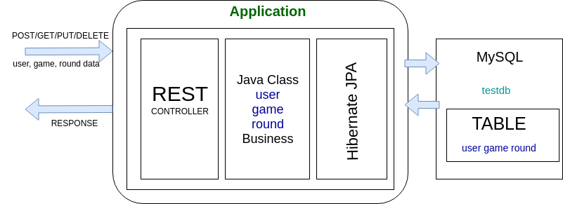
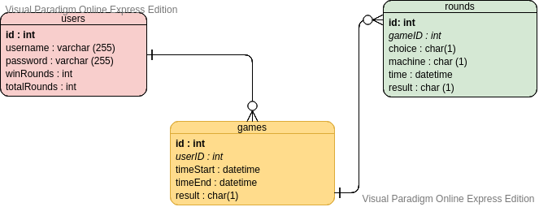
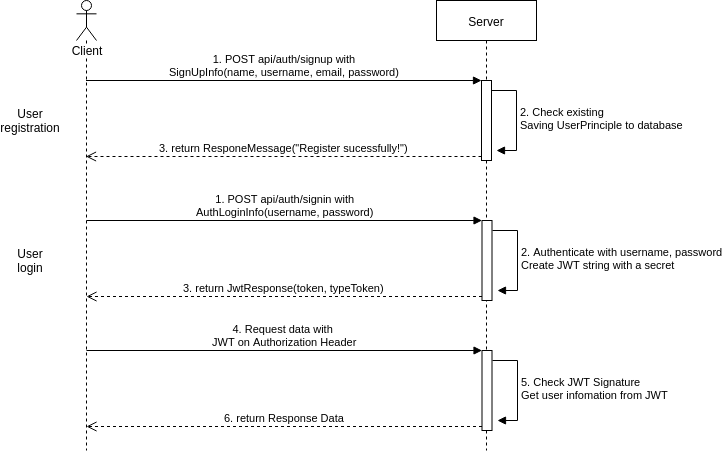
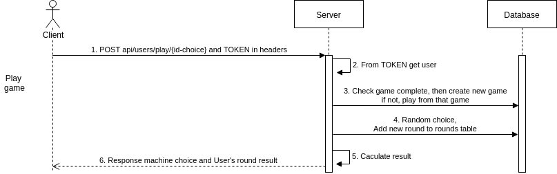
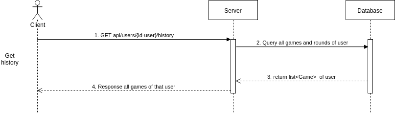
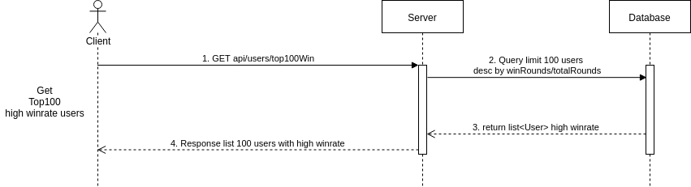

- [1. Đề bài](#1-%c4%90%e1%bb%81-b%c3%a0i)
- [2. Kỹ thuật](#2-k%e1%bb%b9-thu%e1%ba%adt)
- [3. Architecture](#3-architecture)
- [4. Data model](#4-data-model)
  - [4.1. Database Diagram](#41-database-diagram)
  - [4.2. Mô tả chi tiết](#42-m%c3%b4-t%e1%ba%a3-chi-ti%e1%ba%bft)
    - [4.2.1. User](#421-user)
    - [4.2.2. Game](#422-game)
    - [4.2.3. Round](#423-round)
- [5. Sequence diagram flow xử lý các api](#5-sequence-diagram-flow-x%e1%bb%ad-l%c3%bd-c%c3%a1c-api)
- [6. Deployment](#6-deployment)

# 1. Đề bài
-	Thiết kế hệ thống cung cấp APIs cho gameplay của trò chơi Oẳn tù tì với máy. Luật chơi như sau:
-	Mỗi 1 game sẽ gồm n lượt chơi (n >= 1)
-	Trong mỗi lượt, server sẽ trả lời là người chơi thắng, thua hay hoà (kèm kết quả KÉO/BÚA/BAO của máy).
-	Nếu kết quả của lượt chơi là thắng hoặc thua, game kết thúc.
-	Nếu kết quả là hoà, phải chơi thêm lượt tiếp theo đến khi có kết quả thắng hoặc thua.
-	User phải thực hiện đăng nhập mới gọi được API và cung cấp API cho user đăng kí tài khoản.
-	Lưu lại lịch sử tất cả các game + lượt chơi của user.
-	Cung cấp API truy vấn lịch sử tất cả game + lượt chơi của user.
-	Cung cấp API liệt kê danh sách 100 user có tỉ lệ thắng cao nhất.

# 2. Kỹ thuật
-   Cung cấp API cho cả 2 protocol (tránh code duplication):
    -   HTTP với Json
    -   gRPC với Protobuf
-   Sử dụng JWT cho phần authentication.
-   Có thể viết 1 web client đơn giản hoặc sử dụng -    Postman hoặc công cụ bất kì để test API.
-   Viết Unit Test với line coverage 80%.
-   Thực hiện Performance Test cho API sử dụng Locust, JMeter hoặc công cụ tương tự.
-   Ghi log cho tất cả lời gọi tới API. Đối với trường hợp lỗi hệ thống phải log ra được stacktrace và nguyên nhân của lỗi.


# 3. Architecture

- Mô tả tổng quan về hệ thống


  
# 4. Data model

## 4.1. Database Diagram



## 4.2. Mô tả chi tiết 

### 4.2.1. User 

Bảng User lưu trữ chủ yếu username và password dùng cho đăng nhập, định danh người chơi

| Field 	| Type 	| Description 	|
|----------	|--------------	|----------------------------	|
| id 	| int 	| Khóa chính lưu ID của User 	|
| username 	| varchar(255) 	| Lưu tên đăng nhập của User 	|
| password 	| varchar(255) 	| Lưu mật khẩu 	|
| winRounds 	| int 	| Lưu số lượt chơi thắng của User 	|
| totalRounds 	| int 	| Lưu tổng số lượt chơi của User 	|

### 4.2.2. Game

Mỗi User có nhiều ván game, bảng Game lưu trữ các ván game, mỗi ván game thuộc về chỉ 1 User

| Field 	| Type 	| Description 	|
|-----------	|----------	|--------------------------------------------------------	|
| id 	| int 	| Khóa chính lưu ID của ván Game 	|
| userID 	| int 	| Khóa ngoại đến ID của User, ván này của User nào 	|
| timeStart 	| datetime 	| Thời gian bắt đầu ván đấu 	|
| timeEnd 	| datetime 	| Thời gian kết thúc ván đấu 	|
| result 	| char(1) 	| Kết quả ván đấu, 'W' là thắng, 'D' là hoà, 'L' là thua 	|àoáyime

### 4.2.3. Round

Mỗi ván Game có nhiều Turn, mỗi Turn chỉ thuộc duy nhất 1 ván Game

| Field 	| Type 	| Description 	|
|---------	|----------	|--------------------------------------------------------------	|
| id 	| int 	| Khóa chính lưu ID của lượt Round 	|
| userID 	| int 	| Khóa ngoại đến ID của ván Game, lượt chơi này trong Game nào 	|
| choice 	| char(1) 	| Lựa chọn của User, '1' là Kéo, '2' là Búa, '3' là Bao 	|
| machine 	| char(1) 	| Lựa chọn của máy 	|
| time 	| datetime 	| Thời gian lượt đấu 	|
| result 	| char(1) 	| Kết quả lượt đấu, 'W' là thắng, 'D' là hoà, 'L' là thua 	|


# 5. Sequence diagram flow xử lý các api

-   POST `/api/auth/signup`
-   POST `/api/auth/signin`

    

-   POST `/api/users/{id-user}/play/{id-choice}`

    

-   GET `/api/users/{id-user}/history`

    

-   GET `/api/users/top100Win`


    

# 6. Deployment
-   Add dependency vào pom.xml

```xml
    <dependencies>
        <dependency>
            <groupId>org.springframework.boot</groupId>
            <artifactId>spring-boot-starter-data-jpa</artifactId>
        </dependency>
        
        <dependency>
            <groupId>org.springframework.boot</groupId>
            <artifactId>spring-boot-starter-security</artifactId>
        </dependency>
    
        <dependency>
            <groupId>mysql</groupId>
            <artifactId>mysql-connector-java</artifactId>
            <scope>runtime</scope>
        </dependency>

        <dependency>
            <groupId>io.jsonwebtoken</groupId>
            <artifactId>jjwt</artifactId>
            <version>0.9.0</version>
        </dependency>

        <dependency>
            <groupId>org.springframework.boot</groupId>
            <artifactId>spring-boot-starter</artifactId>
        </dependency>

        <dependency>
            <groupId>org.springframework.boot</groupId>
            <artifactId>spring-boot-starter-test</artifactId>
            <scope>test</scope>
        </dependency>

        <dependency>
            <groupId>org.projectlombok</groupId>
            <artifactId>lombok</artifactId>
            <version>1.18.8</version>
            <scope>provided</scope>
        </dependency>

    </dependencies>

```

-   Config trong application.properties

```
spring.datasource.url=jdbc:mysql://localhost:3306/testdb
spring.datasource.username=root
spring.datasource.password=cong
spring.jpa.generate-ddl=true
```

-   Run project with maven in IntelliJ
-   Dùng PostMan để test các route API
-   [Source](/apigame)